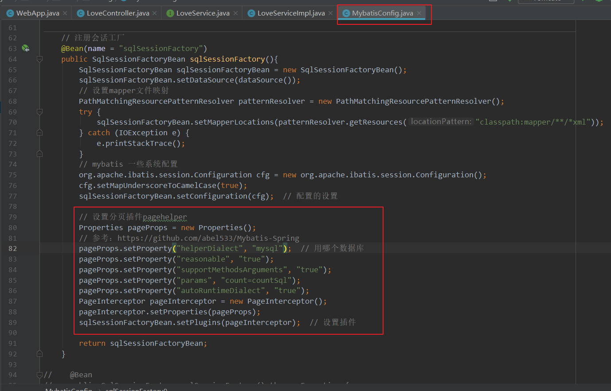

[TOC]


# 1 spring+mybatis+annotation+javaconfig方式整合


## 基本思路

spring和springmvc一家的，所以天然无缝集成

spring和mybatis的整合仅此而已


## 依赖

- spring webmvc
- mybatis
- mysql
- mybatis spring 中间包
- 日志
- lombok
- servlet api
- jstl
- 数据源

```xml
<?xml version="1.0" encoding="UTF-8"?>

<project xmlns="http://maven.apache.org/POM/4.0.0" xmlns:xsi="http://www.w3.org/2001/XMLSchema-instance"
  xsi:schemaLocation="http://maven.apache.org/POM/4.0.0 http://maven.apache.org/xsd/maven-4.0.0.xsd">
  <modelVersion>4.0.0</modelVersion>

  <groupId>com.suki</groupId>
  <artifactId>spring_mybatis_annotation</artifactId>
  <version>1.0-SNAPSHOT</version>
  <packaging>war</packaging>

  <name>spring_mybatis_annotation Maven Webapp</name>
  <!-- FIXME change it to the project's website -->
  <url>http://www.example.com</url>

  <properties>
    <project.build.sourceEncoding>UTF-8</project.build.sourceEncoding>
    <maven.compiler.source>1.8</maven.compiler.source>
    <maven.compiler.target>1.8</maven.compiler.target>
	
    <!--这种引入依赖的方式可以更方便的控制版本，版本都写在一起了-->
    <spring.version>5.1.8.RELEASE</spring.version>
    <mybatis.version>3.5.2</mybatis.version>
    <mysql.version>5.1.48</mysql.version>
    <mybatis-spring.version>2.0.2</mybatis-spring.version>
    <druid.version>1.1.19</druid.version>
    <lombok.version>1.18.8</lombok.version>
    <servlet.version>4.0.1</servlet.version>

  </properties>

  <dependencies>
    <!-- https://mvnrepository.com/artifact/org.springframework/spring-webmvc -->
    <dependency>
      <groupId>org.springframework</groupId>
      <artifactId>spring-webmvc</artifactId>
    </dependency>

    <!-- https://mvnrepository.com/artifact/org.springframework/spring-jdbc -->
    <dependency>
      <groupId>org.springframework</groupId>
      <artifactId>spring-jdbc</artifactId>
    </dependency>

    <!-- https://mvnrepository.com/artifact/org.mybatis/mybatis -->
    <dependency>
      <groupId>org.mybatis</groupId>
      <artifactId>mybatis</artifactId>
    </dependency>


    <!-- https://mvnrepository.com/artifact/mysql/mysql-connector-java -->
    <dependency>
      <groupId>mysql</groupId>
      <artifactId>mysql-connector-java</artifactId>
    </dependency>

    <!-- https://mvnrepository.com/artifact/org.mybatis/mybatis-spring -->
    <dependency>
      <groupId>org.mybatis</groupId>
      <artifactId>mybatis-spring</artifactId>
    </dependency>

    <!-- https://mvnrepository.com/artifact/com.alibaba/druid -->
    <dependency>
      <groupId>com.alibaba</groupId>
      <artifactId>druid</artifactId>
    </dependency>

    <!-- https://mvnrepository.com/artifact/org.projectlombok/lombok -->
    <dependency>
      <groupId>org.projectlombok</groupId>
      <artifactId>lombok</artifactId>
      <scope>provided</scope>
    </dependency>

    <!-- https://mvnrepository.com/artifact/javax.servlet/javax.servlet-api -->
    <dependency>
      <groupId>javax.servlet</groupId>
      <artifactId>javax.servlet-api</artifactId>
      <scope>provided</scope>
    </dependency>


  </dependencies>

  <!--依赖管理-->
  <dependencyManagement>
    <dependencies>
      <!--spring依赖-->
      <!-- https://mvnrepository.com/artifact/org.springframework/spring-webmvc -->
      <dependency>
        <groupId>org.springframework</groupId>
        <artifactId>spring-webmvc</artifactId>
        <version>${spring.version}</version>
      </dependency>

      <!-- https://mvnrepository.com/artifact/org.springframework/spring-jdbc -->
      <dependency>
        <groupId>org.springframework</groupId>
        <artifactId>spring-jdbc</artifactId>
        <version>${spring.version}</version>
      </dependency>


      <!--mybatis依赖-->
      <!-- https://mvnrepository.com/artifact/org.mybatis/mybatis -->
      <dependency>
        <groupId>org.mybatis</groupId>
        <artifactId>mybatis</artifactId>
        <version>${mybatis.version}</version>
      </dependency>

      <!--mysql依赖-->
      <!-- https://mvnrepository.com/artifact/mysql/mysql-connector-java -->
      <dependency>
        <groupId>mysql</groupId>
        <artifactId>mysql-connector-java</artifactId>
        <version>${mysql.version}</version>
      </dependency>

      <!--spring和mybatis的中间依赖-->
      <!-- https://mvnrepository.com/artifact/org.mybatis/mybatis-spring -->
      <dependency>
        <groupId>org.mybatis</groupId>
        <artifactId>mybatis-spring</artifactId>
        <version>${mybatis-spring.version}</version>
      </dependency>

      <!--数据源-->
      <!-- https://mvnrepository.com/artifact/com.alibaba/druid -->
      <dependency>
        <groupId>com.alibaba</groupId>
        <artifactId>druid</artifactId>
        <version>${druid.version}</version>
      </dependency>

      <!--lombok依赖-->
      <!-- https://mvnrepository.com/artifact/org.projectlombok/lombok -->
      <dependency>
        <groupId>org.projectlombok</groupId>
        <artifactId>lombok</artifactId>
        <version>${lombok.version}</version>
        <scope>provided</scope>
      </dependency>


      <!--servlet API-->
      <!-- https://mvnrepository.com/artifact/javax.servlet/javax.servlet-api -->
      <dependency>
        <groupId>javax.servlet</groupId>
        <artifactId>javax.servlet-api</artifactId>
        <version>${servlet.version}</version>
        <scope>provided</scope>
      </dependency>


    </dependencies>

  </dependencyManagement>

  <build>
    <finalName>spring_mybatis_annotation</finalName>
    <pluginManagement><!-- lock down plugins versions to avoid using Maven defaults (may be moved to parent pom) -->
      <plugins>
        <plugin>
          <artifactId>maven-clean-plugin</artifactId>
          <version>3.1.0</version>
        </plugin>
        <!-- see http://maven.apache.org/ref/current/maven-core/default-bindings.html#Plugin_bindings_for_war_packaging -->
        <plugin>
          <artifactId>maven-resources-plugin</artifactId>
          <version>3.0.2</version>
        </plugin>
        <plugin>
          <artifactId>maven-compiler-plugin</artifactId>
          <version>3.8.0</version>
        </plugin>
        <plugin>
          <artifactId>maven-surefire-plugin</artifactId>
          <version>2.22.1</version>
        </plugin>
        <plugin>
          <artifactId>maven-war-plugin</artifactId>
          <version>3.2.2</version>
        </plugin>
        <plugin>
          <artifactId>maven-install-plugin</artifactId>
          <version>2.5.2</version>
        </plugin>
        <plugin>
          <artifactId>maven-deploy-plugin</artifactId>
          <version>2.8.2</version>
        </plugin>
      </plugins>
    </pluginManagement>
  </build>
</project>
```

## 编写初始化的类WebApp.java

```java
package com.suki.app;

import com.suki.config.AppConfig;
import org.springframework.web.servlet.support.AbstractAnnotationConfigDispatcherServletInitializer;

public class WebApp extends AbstractAnnotationConfigDispatcherServletInitializer {

    @Override
    protected Class<?>[] getRootConfigClasses() {
        return new Class[0];
    }

    @Override
    protected Class<?>[] getServletConfigClasses() {
        return new Class[]{AppConfig.class};
    }

    @Override
    protected String[] getServletMappings() {
        return new String[]{"/"};
    }
}
```

## 编写mybatis配置文件MybatisConfig.java

### 把数据的配置外部化properties文件里面db.properties

```properties
db.url=jdbc:mysql://localhost:3306/ssm?useUnicode=true&characterEncoding=UTF-8
db.driver=com.mysql.jdbc.Driver
db.user=root
db.password=
db.maxActive=30
```

### MybatisConfig.java要干的事

1 注册数据源

2 注册会话工厂

3 注册事务管理

```java
package com.suki.config;

import com.alibaba.druid.pool.DruidDataSource;
import org.mybatis.spring.SqlSessionFactoryBean;
import org.mybatis.spring.annotation.MapperScan;
import org.springframework.beans.factory.annotation.Value;
import org.springframework.context.annotation.Bean;
import org.springframework.context.annotation.Configuration;
import org.springframework.context.annotation.PropertySource;
import org.springframework.core.io.support.PathMatchingResourcePatternResolver;
import org.springframework.jdbc.datasource.DataSourceTransactionManager;

import java.io.IOException;

/**
 * mybatis注解配置
 * 参考：mybatis-spring  http://www.mybatis.org/spring/zh/getting-started.html
 */
@Configuration
@PropertySource(value = "classpath:db.properties")
@MapperScan(basePackages = {"com.suki.mapper"})  // 配置扫描接口
public class MybatisConfig {

    @Value("${db.url}")
    private String url;

    @Value("${db.driver}")
    private String driver;

    @Value("${db.user}")
    private String user;

    @Value("${db.password}")
    private String password;

    @Value("${db.maxActive}")
    private int maxActive;

    // 注册数据源
    @Bean(name = "dataSource")
    public DruidDataSource dataSource(){
        DruidDataSource dataSource = new DruidDataSource();
        dataSource.setUrl(url);
        dataSource.setDriverClassName(driver);
        dataSource.setUsername(user);
        dataSource.setPassword(password);
        dataSource.setMaxActive(maxActive);
        return dataSource;
    }


    // 注册会话工厂
    @Bean(name = "sqlSessionFactory")
    public SqlSessionFactoryBean sqlSessionFactory(){
        SqlSessionFactoryBean sqlSessionFactoryBean = new SqlSessionFactoryBean();
        sqlSessionFactoryBean.setDataSource(dataSource());
        // 设置mapper文件映射
        PathMatchingResourcePatternResolver patternResolver = new PathMatchingResourcePatternResolver();
        try {
            sqlSessionFactoryBean.setMapperLocations(patternResolver.getResources("classpath:mapper/**/*xml"));
        } catch (IOException e) {
            e.printStackTrace();
        }
        // mybatis 一些系统配置
        org.apache.ibatis.session.Configuration cfg = new org.apache.ibatis.session.Configuration();
        cfg.setMapUnderscoreToCamelCase(true);
        sqlSessionFactoryBean.setConfiguration(cfg);  // 配置的设置
        return sqlSessionFactoryBean;
    }


    // 注册事务
    @Bean
    public DataSourceTransactionManager transactionManager(){
        DataSourceTransactionManager dataSourceTransactionManager = new DataSourceTransactionManager();
        dataSourceTransactionManager.setDataSource(dataSource());
        return dataSourceTransactionManager;
    }

}
```

## 配置springmvc配置SpringMvcConfig.java

1 暂时只配置了视图解析器

```java
package com.suki.config;

import org.springframework.context.annotation.Bean;
import org.springframework.context.annotation.ComponentScan;
import org.springframework.context.annotation.Configuration;
import org.springframework.web.servlet.view.InternalResourceViewResolver;

@Configuration
@ComponentScan(basePackages = {"com.suki.controller"})
public class SpringMvcConfig {

    // 注册视图解析器
    @Bean
    public InternalResourceViewResolver resourceViewResolver(){
        InternalResourceViewResolver viewResolver = new InternalResourceViewResolver();
        viewResolver.setPrefix("/pages/");
        viewResolver.setSuffix(".jsp");
        return viewResolver;
    }

}
```


## 准备数据库

新建数据库名为`ssm`，在里面新建一个名为`love`的表

```sql
CREATE DATABASE  ssm;

USE `ssm`;

 

CREATE TABLE `love` (
  `love_id` bigint(20) NOT NULL AUTO_INCREMENT,
  `first_name` varchar(255) DEFAULT NULL,
  `last_name` varchar(255) DEFAULT NULL,
  `birth` date DEFAULT NULL,
  PRIMARY KEY (`love_id`)
) ENGINE=InnoDB AUTO_INCREMENT=9 DEFAULT CHARSET=utf8;
```


## 准备pojo

```java
package com.suki.model;

import lombok.AllArgsConstructor;
import lombok.Data;
import lombok.NoArgsConstructor;

import java.time.LocalDate;

@Data  // lombok自动构造set get方法
@NoArgsConstructor  // 自动构造无参构造器
@AllArgsConstructor  // 全部参数构造器
public class Love {
    private Long loveId;
    private String firstName;
    private String lastName;
    private LocalDate birth;
}
```

## 准备mapper

```java
package com.suki.mapper;

import com.suki.model.Love;

public interface LoveMapper {  // 这里按 alt + Enter 可以选择创建mapper xml文件
    void insert(Love love);

    Love selectById(long id);
}
```


## mapper xml文件

```xml
<?xml version="1.0" encoding="UTF-8" ?>
<!DOCTYPE mapper PUBLIC "-//mybatis.org//DTD Mapper 3.0//EN" "http://mybatis.org/dtd/mybatis-3-mapper.dtd" >
<mapper namespace="com.suki.mapper.LoveMapper">
    <insert id="insert">
        insert into love (first_name,last_name,birth)
        value(#{firstName},#{lastName},#{birth})
    </insert>

    <select id="selectById" resultType="com.suki.model.Love">
      select *
      from love where love_id = #{id}
    </select>
</mapper>
```

## 控制器LoveCOntroller.java

```java
package com.suki.controller;

import com.suki.model.Love;
import com.suki.service.LoveService;
import org.springframework.beans.factory.annotation.Autowired;
import org.springframework.stereotype.Controller;
import org.springframework.ui.Model;
import org.springframework.web.bind.annotation.GetMapping;
import org.springframework.web.bind.annotation.PathVariable;
import org.springframework.web.bind.annotation.RequestMapping;

@Controller
@RequestMapping("love")
public class LoveController {

    @Autowired
    private LoveService loveService;

    @RequestMapping("save")
    public String save(Love love){
        loveService.save(love);
        return "love/list";
    }


    // 测试查询
    // 弄了好久不知道哪里出错了，结果把 web.xml 删除之后就可以了。。。
    @GetMapping("get/{id}")
    public String get(@PathVariable("id")long id, Model model){
        Love love = loveService.get(id);
        System.out.println(love);
        model.addAttribute("love", love);  // 将根据id查询出来的love对象增加到request域中
        return "love/detail";
    }
}
```

## 业务接口和实现

### LoveService.java

```java
package com.suki.service;

import com.suki.model.Love;

public interface LoveService {
    void save(Love love);

    Love get(long id);
}
```

### LoveServiceImpl.java

```java
package com.suki.service.impl;

import com.suki.mapper.LoveMapper;
import com.suki.model.Love;
import com.suki.service.LoveService;
import org.springframework.beans.factory.annotation.Autowired;
import org.springframework.stereotype.Service;

@Service
public class LoveServiceImpl implements LoveService {

    @Autowired
    private LoveMapper loveMapper;

    @Override
    public void save(Love love) {
        loveMapper.insert(love);
    }

    @Override
    public Love get(long id) {
        return loveMapper.selectById(id);
    }
}
```

## 页面编写省略


# 2 整合提高

## 通用mapper

为了简化我们单表操作，我们会选择加入通用mapper的依赖，来解决基本`CURD`

引入必要的依赖：

```xml
<dependency>
    <groupId>tk.mybatis</groupId>
    <artifactId>mapper</artifactId>
    <version>4.1.5</version>
</dependency>
<dependency>
    <groupId>org.slf4j</groupId>
    <artifactId>slf4j-api</artifactId>
    <version>1.7.26</version>
</dependency>
```

参考通用mapper的文档：https://github.com/abel533/Mybatis-Spring

### 重写MybatisConfig.java

```java
package com.suki.config;

import com.alibaba.druid.pool.DruidDataSource;
import com.github.pagehelper.PageInterceptor;
import org.apache.ibatis.session.SqlSessionFactory;
import org.mybatis.spring.SqlSessionFactoryBean;
import org.springframework.beans.factory.annotation.Value;
import org.springframework.context.annotation.Bean;
import org.springframework.context.annotation.Configuration;
import org.springframework.context.annotation.PropertySource;
import org.springframework.core.io.support.PathMatchingResourcePatternResolver;
import org.springframework.jdbc.datasource.DataSourceTransactionManager;
import tk.mybatis.mapper.common.Mapper;
import tk.mybatis.mapper.entity.Config;
import tk.mybatis.mapper.mapperhelper.MapperHelper;
import tk.mybatis.spring.annotation.MapperScan;

import java.io.IOException;
import java.util.ArrayList;
import java.util.List;
import java.util.Properties;

/**
 * mybatis注解配置
 * 参考：mybatis-spring  http://www.mybatis.org/spring/zh/getting-started.html
 */
@Configuration
@PropertySource(value = "classpath:db.properties")
// 使用通用mapper下的注解
// 参考：https://github.com/abel533/Mapper/wiki/1.2-spring
@MapperScan(value = {"tk.mybatis.mapper.annotation","com.suki.mapper"}, mapperHelperRef = "mapperHelper")
public class MybatisConfig {

    @Value("${db.url}")
    private String url;

    @Value("${db.driver}")
    private String driver;

    @Value("${db.user}")
    private String user;

    @Value("${db.password}")
    private String password;

    @Value("${db.maxActive}")
    private int maxActive;

    // 注册数据源
    @Bean(name = "dataSource")
    public DruidDataSource dataSource(){
        DruidDataSource dataSource = new DruidDataSource();
        dataSource.setUrl(url);
        dataSource.setDriverClassName(driver);
        dataSource.setUsername(user);
        dataSource.setPassword(password);
        dataSource.setMaxActive(maxActive);
        return dataSource;
    }


    // 注册会话工厂
    @Bean(name = "sqlSessionFactory")
    public SqlSessionFactoryBean sqlSessionFactory(){
        SqlSessionFactoryBean sqlSessionFactoryBean = new SqlSessionFactoryBean();
        sqlSessionFactoryBean.setDataSource(dataSource());
        // 设置mapper文件映射
        PathMatchingResourcePatternResolver patternResolver = new PathMatchingResourcePatternResolver();
        try {
            sqlSessionFactoryBean.setMapperLocations(patternResolver.getResources("classpath:mapper/**/*xml"));
        } catch (IOException e) {
            e.printStackTrace();
        }
        // mybatis 一些系统配置
        org.apache.ibatis.session.Configuration cfg = new org.apache.ibatis.session.Configuration();
        cfg.setMapUnderscoreToCamelCase(true);
        sqlSessionFactoryBean.setConfiguration(cfg);  // 配置的设置

        // 设置分页插件pagehelper
        Properties pageProps = new Properties();
        // 参考：https://github.com/abel533/Mybatis-Spring
        pageProps.setProperty("helperDialect", "mysql");  // 用哪个数据库
        pageProps.setProperty("reasonable", "true");
        pageProps.setProperty("supportMethodsArguments", "true");
        pageProps.setProperty("params", "count=countSql");
        pageProps.setProperty("autoRuntimeDialect", "true");
        PageInterceptor pageInterceptor = new PageInterceptor();
        pageInterceptor.setProperties(pageProps);
        sqlSessionFactoryBean.setPlugins(pageInterceptor);  // 设置插件

        return sqlSessionFactoryBean;
    }

//    @Bean
//    public SqlSessionFactory sqlSessionFactory() throws Exception {
//        SqlSessionFactoryBean sessionFactory = new SqlSessionFactoryBean();
//        sessionFactory.setDataSource(dataSource());
//        //tk.mybatis.mapper.session.Configuration
//        tk.mybatis.mapper.session.Configuration configuration = new tk.mybatis.mapper.session.Configuration();
//        //可以对 MapperHelper 进行配置后 set
//        configuration.setMapperHelper(new MapperHelper());
//        //设置为 tk 提供的 Configuration
//        sessionFactory.setConfiguration(configuration);
//        return sessionFactory.getObject();
//    }


    // 注册事务
    @Bean
    public DataSourceTransactionManager transactionManager(){
        DataSourceTransactionManager dataSourceTransactionManager = new DataSourceTransactionManager();
        dataSourceTransactionManager.setDataSource(dataSource());
        return dataSourceTransactionManager;
    }


    //
    @Bean
    public MapperHelper mapperHelper(){
        Config config = new Config();
        List<Class> mappers = new ArrayList<>();
        mappers.add(Mapper.class);
        config.setMappers(mappers);

        MapperHelper mapperHelper = new MapperHelper();
        mapperHelper.setConfig(config);
        return mapperHelper;
    }
}
```

### mapper文件

mapper文件选择继承`BaseMapper`

```java
package com.suki.mapper;

import com.suki.model.Love;
import tk.mybatis.mapper.common.BaseMapper;

/**
 * 通过继承BaseMapper<Love>通用mapper
 * 这样对 Love 对象的CURD就自动完成了
 */
public interface LoveMapper extends BaseMapper<Love> {  // 这里按 alt + Enter 可以选择创建mapper xml文件
    // 这里面什么都不用写了！这就是通用mapper的好处，帮你把最常用的CURD封装好了
}
```

如果要支持主键查询等操作，配置一下主键策略：

将pojo的Love.java中的id属性增加为：

```java
// 添加主键策略
@Id
@GeneratedValue(strategy = GenerationType.IDENTITY)
private Long loveId;
```


## 分页功能集成

以插件的方式完成分页功能

添加依赖：

```xml
<dependency>
    <groupId>com.github.pagehelper</groupId>
    <artifactId>pagehelper</artifactId>
    <version>5.1.10</version>
</dependency>
```

整合进入项目：



模板代码参考：

```java
public PageInfo<Love> query(Integer pageNum, Integer pageSize) {
    // 分页查询
    PageHelper.startPage(pageNum,pageSize);// 统计多少数据
    List<Love> loves = loveMapper.selectAll();
    PageInfo<Love> pageInfo = new PageInfo<>(loves);
    return pageInfo;
}
```

插件文档参考：https://github.com/abel533/Mybatis-Spring

具体怎么使用建议查看项目里面`LoveController`里面的`query()`方法


## JSON支持

消息转换处理

重写AppConfig.java，添加消息转换器，记得添加@EnableWebMvc

```java
package com.suki.config;

import com.alibaba.fastjson.support.spring.FastJsonHttpMessageConverter;
import org.springframework.context.annotation.Bean;
import org.springframework.context.annotation.ComponentScan;
import org.springframework.context.annotation.Configuration;
import org.springframework.context.annotation.Import;
import org.springframework.http.MediaType;
import org.springframework.http.converter.HttpMessageConverter;
import org.springframework.web.servlet.config.annotation.DefaultServletHandlerConfigurer;
import org.springframework.web.servlet.config.annotation.EnableWebMvc;
import org.springframework.web.servlet.config.annotation.WebMvcConfigurer;
import org.springframework.web.servlet.resource.DefaultServletHttpRequestHandler;

import java.util.ArrayList;
import java.util.List;

/**
 * 总配置类
 */
@Configuration
@ComponentScan(basePackages = {"com.suki.service"})
@Import({MybatisConfig.class, SpringMvcConfig.class})  // 导入其他配置类
@EnableWebMvc
public class AppConfig implements WebMvcConfigurer {

    @Override
    public void extendMessageConverters(List<HttpMessageConverter<?>> converters) {
        // 配置fastjson
        FastJsonHttpMessageConverter converter = new FastJsonHttpMessageConverter();
        List<MediaType> mediaTypes = new ArrayList<>();
        mediaTypes.add(MediaType.APPLICATION_JSON);
        converter.setSupportedMediaTypes(mediaTypes);
        // 添加额外的消息转发器
        converters.add(converter);
    }


    // 解决jsp页面引入外部css文件不生效的问题
    @Override
    public void configureDefaultServletHandling(DefaultServletHandlerConfigurer configurer) {
        configurer.enable();
    }
}
```

注：使用下面这种方式也可以：

```java
package com.qiudaozhang.config;

import com.alibaba.fastjson.support.config.FastJsonConfig;
import com.alibaba.fastjson.support.spring.FastJsonHttpMessageConverter;
import org.springframework.context.annotation.Bean;
import org.springframework.context.annotation.ComponentScan;
import org.springframework.context.annotation.Configuration;
import org.springframework.context.annotation.Import;
import org.springframework.http.MediaType;
import org.springframework.http.converter.HttpMessageConverter;
import org.springframework.web.servlet.config.annotation.EnableWebMvc;
import org.springframework.web.servlet.config.annotation.WebMvcConfigurer;

import java.util.ArrayList;
import java.util.List;

/**
 * 总配置类
 */
@Configuration
@ComponentScan(basePackages = {"com.qiudaozhang.service"})
@Import({MybatisConfig.class,SpringMvcConfig.class})// 导入其它的配置类
@EnableWebMvc
public class AppConfig implements WebMvcConfigurer {


    // 注册一个会话工厂  需要数据源

    @Bean
    public FastJsonHttpMessageConverter fastJsonHttpMessageConverter(){
        FastJsonHttpMessageConverter converter = new FastJsonHttpMessageConverter();
        FastJsonConfig fastConfig = new FastJsonConfig();
        fastConfig.setDateFormat("yyyy-MM-dd");
        converter.setFastJsonConfig(fastConfig);
        List<MediaType> mediaTypes = new ArrayList<>();
        mediaTypes.add(MediaType.APPLICATION_JSON);
        converter.setSupportedMediaTypes(mediaTypes);
        return converter;
    }


    @Override
    public void extendMessageConverters(List<HttpMessageConverter<?>> converters) {
        // 添加额外的消息转换器
        converters.add(fastJsonHttpMessageConverter());
    }
}
```


## 静态资源404的问题

比如说某个jsp页面引入外部样式文件不生效的问题

解决：添加默认的handler，在AppConfig.java中添加如下代码：

```java
@Override
public void configureDefaultServletHandling(DefaultServletHandlerConfigurer configurer) {
    configurer.enable();
}
```


