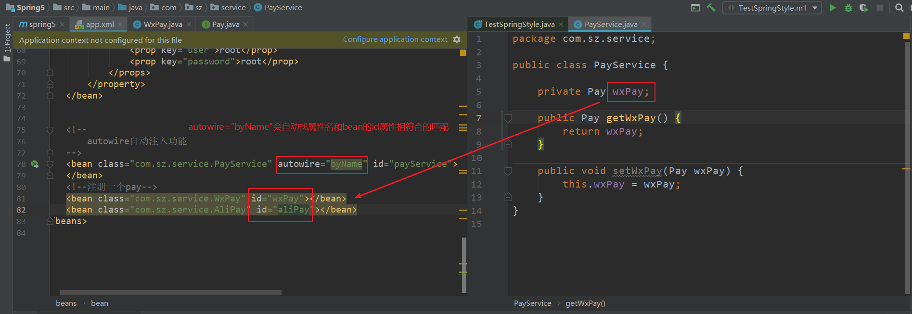
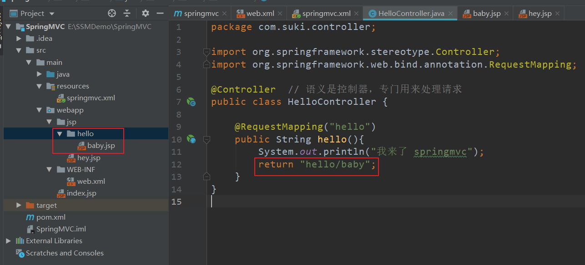

[TOC]


## MyBatis

+ 半自动化的ORM实现
+ DAO层
+ 动态SQL（灵魂所在）
+ 小巧灵活，简单易学


### 什么是持久化？

可以将程序数据存储到`物理介质`上

程序数据在`瞬时状态（内存）`和`持久状态（磁盘）`间转换的过程


### ORM（Obeject Relational Mapping）

+ 对象关系映射
+ 编写程序的时候，以面向对象的方式处理数据
+ 保存数据的时候，却以关系型数据库的方式存储


#### ORM解决了什么痛点？

+ 在持久化对象上执行基本的增、删、改、查操作
+ 对持久化对象提供一种查询语言或者API
+ 对象关系映射工具
+ 提供与事务对象交互、执行检查、延迟加载以及其他优化功能


### MyBatis框架的优缺点

优点

+ 与JDBC相比，减少了50%以上的代码量

+ 最简单的持久化框架，小巧并简单易学

+ SQL代码从程序代码中彻底分离，可重用

+ 提供XML标签，支持编写动态SQL

+ 提供映射标签，支持对象与数据库的ORM字段映射

缺点

+ SQL语句编写工作量大，对开发人员有一定要求

+ 数据库移植性差


MyBatis专注于SQL本身，是一个足够灵活的DAO层解决方案，适用于性能要求较高或者需求多变的互联网项目


### MyBatis入门案例

#### 1 新建maven项目


#### 2 引入mybatis依赖，mysql依赖

```xml
<!--MyBatis依赖，去maven仓库寻找-->
<!-- https://mvnrepository.com/artifact/org.mybatis/mybatis -->
<dependency>
    <groupId>org.mybatis</groupId>
    <artifactId>mybatis</artifactId>
    <version>3.5.1</version>
</dependency>

<!--MySql依赖，现在用的是5的版本-->
<!-- https://mvnrepository.com/artifact/mysql/mysql-connector-java -->
<dependency>
    <groupId>mysql</groupId>
    <artifactId>mysql-connector-java</artifactId>
    <version>5.1.47</version>
</dependency>
```

#### 3 编写mybatis的核心配置文件`mybatis.cfg.xml`

```xml
<?xml version="1.0" encoding="UTF-8" ?>
<!DOCTYPE configuration
        PUBLIC "-//mybatis.org//DTD Config 3.0//EN"
        "http://mybatis.org/dtd/mybatis-3-config.dtd">

<configuration>
    <!--核心配置-->

    <!--
    环境们  default使用哪个环境
    开发的时候一般会区分不同的环境
    dev
    test
    prod
    -->
    <environments default="dev">
        <environment id="dev">
            <transactionManager type="JDBC"></transactionManager>
            <dataSource type="POOLED">
                <!--配置连接数据库的四个基本属性-->
                <property name="driver" value="com.mysql.jdbc.Driver"></property>
                <property name="url" value="jdbc:mysql://localhost:3306/smbms"></property>
                <property name="username" value="root"></property>
                <property name="password" value=""></property>
            </dataSource>
        </environment>
    </environments>

    <!--
        将mapper文件引入到mybatis核心配置文件之中
    -->
    <mappers>
        <!--只有写了这一行，mybatis才知道这个文件的存在-->
        <mapper resource="mapper/UserMapper.xml"></mapper>
    </mappers>
</configuration>
```


#### 4 编写pojo

```java
package com.smbms.pojo;

import java.util.Date;

public class User {

// 表里面键的名称
//id
//userCode
//userName
//userPassword
//gender
//birthday
//phone
//address
//userRole
//createdBy
//creationDate
//modifyBy
//modifyDate
    
// 每个键对应的类型
//bigint
//varchar
//varchar
//varchar
//int
//date
//varchar
//varchar
//bigint
//bigint
//datetime
//bigint
//datetime

    private Long id;  // 数据库中的bigint对应java的Long
    private String userCode;
    private String userName;
    private String userPassword;
    private Integer gender;
    private Date birthday;
    private String phone;
    private String address;
    private Long userRole;
    private Long createdBy;
    private Date creationDate;
    private Long modifyBy;
    private Date modifyDate;


    // get set方法
    // 注：get set方法简易生成可以使用lombok
    // 只需要在pojo类上加上注解@Data
    // 再在IDEA下载lombok插件即可
}
```

#### 5 编写Mapper.xml

最好将所有的Mapper文件放在`mapper`文件夹下


```xml
<?xml version="1.0" encoding="UTF-8" ?>
<!DOCTYPE mapper
        PUBLIC "-//mybatis.org//DTD Mapper 3.0//EN"
        "http://mybatis.org/dtd/mybatis-3-mapper.dtd">

<!--
    定义一个namespace 命名空间，我们可以唯一限定我们是用哪个文件
-->

<mapper namespace="com.smbms.mapper.UserMapper">
    <!--
        通过一系列的标签来完成的
    -->

    <!--sql语句可以不加分号-->
    <select id="countUser" resultType="java.lang.Integer">
        select count(*)
        from smbms_user
    </select>
</mapper>

```

记得将这个mapper文件引入到mybatis核心配置文件

在`mybatis.cfg.xml`中添加：

```xml
<mappers>
    <!-- 只有这样，mybatis才知道这个文件的存在-->
    <mapper resource="mapper/UserMapper.xml"/>
</mappers>
```


#### 6 通过mybatis的核心APl操作我们的数据库

```java
import org.apache.ibatis.io.Resources;
import org.apache.ibatis.session.SqlSession;
import org.apache.ibatis.session.SqlSessionFactory;
import org.apache.ibatis.session.SqlSessionFactoryBuilder;
import org.junit.Test;

import java.io.IOException;
import java.io.InputStream;

public class TestMyBatis {


    // 测试用户表里面的数据总量
    @Test
    public void testUserCount(){

        // 1. 读取核心的配置文件
        String resource = "mybatis.cfg.xml";

        // 2. 提供了一个Resource工具类，将我们的文件转换为输入流对象，再去解析
        try {
            InputStream in = Resources.getResourceAsStream(resource);
            // 3. 使用SqlSessionFactoryBuilder来构建会话工厂
            SqlSessionFactory sqlSessionFactory = new SqlSessionFactoryBuilder().build(in);
            // 4. 利用会话工厂来生产会话
            SqlSession session = sqlSessionFactory.openSession();
            // 5. 利用会话完成数据库的操作
            Object o = session.selectOne("com.smbms.mapper.UserMapper.countUser");  // 写入mapper里的namespace + id
            System.out.println(o);
            // 6. 记得提交事务，关闭资源
            session.commit();
            session.close();
        } catch (IOException e) {
            e.printStackTrace();
        }

    }
}
```


### 抽象出一个MyBatis工具类

```java
package com.smbms.util;

import org.apache.ibatis.io.Resources;
import org.apache.ibatis.session.SqlSession;
import org.apache.ibatis.session.SqlSessionFactory;
import org.apache.ibatis.session.SqlSessionFactoryBuilder;

import java.io.IOException;
import java.io.InputStream;

/**
 * mybatis工具类
 */
public class MyBatisUtil {
    private static SqlSessionFactory sqlSessionFactory;

    static {
        // 1. 读取核心的配置文件
        String resource = "mybatis.cfg.xml";
        InputStream in = null;

        try {
            in = Resources.getResourceAsStream(resource);
            // 3. 使用SqlSessionFactoryBuilder来构建会话工厂
            sqlSessionFactory = new SqlSessionFactoryBuilder().build(in);
        } catch (IOException e) {
            e.printStackTrace();
        }

    }

    public static SqlSession createSqlSession(){
        return sqlSessionFactory.openSession();
    }
}
```

使用这个工具类：

```java
// 测试用户表里面的数据总量
@Test
public void testUserCount(){
    SqlSession session = MyBatisUtil.createSqlSession();

    Object o = session.selectOne("com.smbms.mapper.UserMapper.countUser");
    System.out.println(o);

    session.commit();
    session.close();
}
```


### 上面方式的弊端

通过session执行sql语句时，上面讲的都是`通过SqlSession实例直接运行映射的SQL语句`，如：

```java
// 书写字符串的方式太容易出错了
Object o = session.selectOne("com.smbms.mapper.UserMapper.countUser");
System.out.println(o);
```

但是可以发现这样每次写的字符串太容易出错！！！


所以mybatis还提供了另一种操作数据的方式：`基于Mapper接口方式操作数据`，**这才是现在我们使用的主流方法**

#### 基于Mapper接口方式操作数据

首先新建立一个mapper包，里面定义一个接口，使其和mapper文件完成绑定


在接口里面再定义和mapper文件里面`id`属性一致的方法


使用测试：

```java
// 测试用户表里面的数据总量
@Test
public void testUserCount(){
    SqlSession session = MyBatisUtil.createSqlSession();

    // 这种方式更好，因为编译能告诉我们哪里有错
    UserMapper mapper = session.getMapper(UserMapper.class);
    int row = mapper.countUser();
    System.out.println(row);

    session.commit();
    session.close();
}
```


### 查询集合示例

UserMapper接口文件里新增一个方法

```java
package com.smbms.mapper;

import com.smbms.pojo.User;

import java.util.List;

public interface UserMapper {
    int countUser();

    List<User> queryAll();
}
```

UserMapper.xml里面新增执行SQL

```xml
<mapper namespace="com.smbms.mapper.UserMapper">
    <!--
        通过一系列的标签来完成的
    -->

    <!--sql语句可以不加分号-->
    <select id="countUser" resultType="java.lang.Integer">
        select count(*)
        from smbms_user
    </select>

    <!--注意返回值不要写集合的类型，只需要描述集合里面是什么元素类型即可-->
    <select id="queryAll" resultType="com.smbms.pojo.User">
        select *
        from smbms_user
    </select>
</mapper>
```

**注意返回值不要写集合的类型，只需要描述集合里面是什么元素类型即可**

测试返回集合：

```java
public class TestMyBatis_Interface {

    private SqlSession session;

    @Before
    public void pre(){
        session = MyBatisUtil.createSqlSession();
    }

    @Test
    public void testQueryAll(){
        UserMapper mapper = session.getMapper(UserMapper.class);
        List<User> users = mapper.queryAll();
        System.out.println(users);
    }

    @After
    public void after(){
        session.commit();
        session.close();
    }
}
```


### 数据库设计列名和java里面属性名不一致的情况


可以通过指定别名的方式封装进行


### 配置properties元素

+ 法1：通过外部指定的方式（database.properties）实现动态配置

新建`db.properties`

```properties
driver=com.mysql.jdbc.Driver
url=jdbc:mysql://localhost:3306/smbms
username=root
password=
```

修改`mybatis.cfg.xml`:

```xml
<!--
        通过resource属性引入外部的属性文件
        引入外部之后它的优先级高于内部书写的内容
        里面的<property>写错某些value或者干脆不写都行，只要外部文件是对的即可
-->
<properties resource="db.properties">
    <!--<property name="driver" value="com.mysql.jdbc.Driver"></property>-->
    <!--<property name="url" value="jdbc:mysql://localhost:3306/smbms"></property>-->
    <!--<property name="username" value="root"></property>-->
    <!--<property name="password" value=""></property>-->
</properties>

<environments default="dev">
    <environment id="dev">
        <transactionManager type="JDBC"></transactionManager>
        <dataSource type="POOLED">
            <!--配置连接数据库的四个基本属性-->
            <property name="driver" value="${driver}"></property>
            <property name="url" value="${url}"></property>
            <property name="username" value="${username}"></property>
            <property name="password" value="${password}"></property>
        </dataSource>
    </environment>
</environments>
```


+ 法2：直接配置xml，实现动态配置

修改`mybatis.cfg.xml`：

```xml
<!--内部方式-->
<properties>
    <property name="driver" value="com.mysql.jdbc.Driver"></property>
    <property name="url" value="jdbc:mysql://localhost:3306/smbms"></property>
    <property name="username" value="root"></property>
    <property name="password" value=""></property>
</properties>

<environments default="dev">
    <environment id="dev">
        <transactionManager type="JDBC"></transactionManager>
        <dataSource type="POOLED">
            <!--配置连接数据库的四个基本属性-->
            <property name="driver" value="${driver}"></property>
            <property name="url" value="${url}"></property>
            <property name="username" value="${username}"></property>
            <property name="password" value="${password}"></property>
        </dataSource>
    </environment>
</environments>
```


综上：`properties`的优先级为：

+ 字面值优先级最高
+ properties的外部引用文件（使用占位符）
+ properties内部的值


### 别名机制

+ 单个注册

```xml
<typeAliases>
    <typeAlias type="com.smbms.pojo.User"></typeAlias>
</typeAliases>
```

如果我们缺省名字，默认注册就是使用简写的类名，并且不区分大小写

user,User,UsEr都是一样的，比如下面：

```xml
<select id="queryAll" resultType="UsEr">
    select *
    from smbms_user
</select>
```


+ 单个注册中使用自定义的别名，而不是缺省的别名

只需要加上`alias`属性即可

```xml
<typeAliases>
    <typeAlias type="com.smbms.pojo.User" alias="heroUser"></typeAlias>
</typeAliases>
```

`com.smbms.pojo.User`的别名即为`heroUser`

zhixuya


+ 包注册

```xml
<typeAliases>
    <package name="com.smbms.pojo"></package>
</typeAliases>
```

同理，注册的包下所有的类都相当于被注册了

而且也不区分大小写


+ 别名可以有多个，并且单个别名可以和包别名混用

+ 虽然提供了别名的机制，但还是尽量使用全限定类名


### 模糊查询

#### 注：mybatis查询有关中文关键字时返回结果为空的问题

参考：https://www.jb51.net/article/88236.htm

MySQL在进行中文检索时，需要在jdbcURL后增加参数`useUnicode=true&characterEncoding=UTF-8`来指定编码格式


#### 方式一 使用concat内建函数

```xml
<select id="queryByUserName" resultType="com.smbms.pojo.User">
    select * from smbms_user where userName like concat('%',#{userName},'%')
</select>
```

查询示例：

```java
@Test
public void testQueryByUserName(){
    UserMapper mapper = session.getMapper(UserMapper.class);
    List<User> users = mapper.queryByUserName("孙");
    System.out.println(users);
}
```

#### 方式二 从外部入参处理

```xml
<select id="queryByUserName" resultType="com.smbms.pojo.User">
    select * from smbms_user where userName like #{userName}
</select>
```

查询示例：

```java
@Test
public void testQueryByUserName(){
    UserMapper mapper = session.getMapper(UserMapper.class);
    List<User> users = mapper.queryByUserName("%孙%");
    System.out.println(users);
}
```

#### 方式三 使用里面的参数重新绑定

```xml
<select id="queryByUserName" resultType="com.smbms.pojo.User">
    <bind name="newUserName" value="'%'+userName+'%'"></bind>
    select * from smbms_user where userName like #{newUserName}
</select>
```

还需要`@Param`

```java
List<User> queryByUserName(@Param("userName") String userName);
```

查询示例：

```java
@Test
public void testQueryByUserName(){
    UserMapper mapper = session.getMapper(UserMapper.class);
    List<User> users = mapper.queryByUserName("孙");
    System.out.println(users);
}
```


### 参数问题

+ 如果传入的是单个参数的话，mybatis解析参数没有任何问题。写啥都可以得到结果，但是最好还是有语义

比如：

```java
@Test
public void testQueryByUserName(){
    UserMapper mapper = session.getMapper(UserMapper.class);
    List<User> users = mapper.queryByUserName("%孙%");
    System.out.println(users);
}
```

```xml
<select id="queryByUserName" resultType="com.smbms.pojo.User">
    <bind name="newUserName" value="'%'+userName+'%'"></bind>
    <!--当传入的只有一个参数时，就算你写 awsl 也能得到结果-->
    select * from smbms_user where userName like #{awsl}
</select>
```


+ 多参数处理：多个参数分开传入

由于mybatis默认的处理方式是arg0,arg1……/param1,param2……这种模式

由于没有语义不推荐使用，我们最好使用注解`@Param`来指定参数


在接口文件中指定注解`@Param`：

```java
public interface UserMapper {
    int countUser();

    List<User> queryAll();

    List<User> queryByUserNameUserRole(@Param("userName") String userName, @Param("userRole") Integer userRole);
}
```

xml中使用注解的名字：

```xml
<select id="queryByUserNameUserRole" resultType="com.smbms.pojo.User">
    select * from smbms_user where userName like #{userName} and userRole=#{userRole}
</select>
```

查询示例：

```java
@Test
public void testQueryByUserName(){
    UserMapper mapper = session.getMapper(UserMapper.class);
    List<User> users = mapper.queryByUserNameUserRole("%孙%", 3);
    System.out.println(users);
}
```


+ 多参数处理：使用pojo拼接处理

传入对象达到多参数的处理

```java
List<User> queryByUserNameUserRole(User u);
```

```xml
<select id="queryByUserNameUserRole" resultType="com.smbms.pojo.User">
    select * from smbms_user where userName like #{userName} and userRole=#{userRole}
</select>
```

```java
@Test
public void testQueryByUserName(){
    UserMapper mapper = session.getMapper(UserMapper.class);
    User u = new User();
    u.setUserName("%孙%");
    u.setUserRole(3L);
    List<User> users = mapper.queryByUserNameUserRole(u);
    System.out.println(users);
}
```


### 多表联合查询

+ 多表查询一定记得要使用`resultMap`!!!

```xml
<!--type对应返回值类型-->
<resultMap id="withRole" type="com.smbms.pojo.User">
    <!--column对应数据库里的真实字段名-->
    <!--property对应pojo的属性名-->
    <result column="userCode" property="userCode"></result>
    <result column="userName" property="userName"></result>
    <result column="roleName" property="userRoleName"></result>
</resultMap>

<!--下面的resultMap对应上面的id值-->
<select id="queryWithRole" resultMap="withRole">
    select u.userCode,userName,r.roleName from smbms_user u, smbms_role r where u.userRole = r.id
</select>
```


### resultType和resultMap

+ resultType：直接表示返回类型
  + 基本数据类型
  + 复杂数据类型
+ resultMap：对外部resultMap的引用
  + 应用场景：
    + 数据库字段信息和对象属性不一致
    + 复杂的联合查询，自由控制映射结果
+ **resultType和resultMap不能同时存在，本质上都是Map数据结构**


### 插入操作（增）

```xml
<insert id="insert">
    insert into smbms_user (id,userCode,userName) value(#{id},#{userCode},#{userName})
</insert>
```

```java
@Test
public void test(){
    UserMapper mapper = session.getMapper(UserMapper.class);

    User u = new User();
    u.setId(333L);
    u.setUserCode("Hello Baby");
    u.setUserName("Baby");

    mapper.insert(u);
}
```

### 更新操作（改）

```xml
<update id="update">
    update smbms_user
    set userCode = #{userCode},
    userName = #{userName}
    where id = #{id}
</update>
```

```java
@Test
public void test(){
    UserMapper mapper = session.getMapper(UserMapper.class);

    User u = new User();
    u.setId(333L);
    u.setUserCode("baby");
    u.setUserName("杨颖");

    mapper.update(u);
}
```

### 使用@param进行修改（改2）

接口文件中：

```java
void update2(@Param("id") Long id, @Param("password") String password);
```

mapper文件中：

```xml
<update id="update2">
    update smbms_user
    set userPassword = #{password}
    where id = #{id}
</update>
```

测试：

```java
@Test
public void test(){
    UserMapper mapper = session.getMapper(UserMapper.class);

    User u = new User();

    mapper.update2(333L, "wodetian");
}
```


### 删除操作（删） 

接口文件：

```java
void deleteById(@Param("id")Long id);
```

mapper文件中：

```xml
<delete id="deleteById">
    delete
    from smbms_user
    where id=#{id}
</delete>
```

测试：

```java
@Test
public void test(){
    UserMapper mapper = session.getMapper(UserMapper.class);

    mapper.deleteById(333L);
}
```


### resultType子元素：collection

+ 功能：映射到JavaBean的某个"复杂类型"属性，比如集合
+ 相当于一种**一对多**的情况，映射一个嵌套结果集到一个列表
+ 属性
  + property：映射完整数据库列的实体对象的属性
  + ofType：完整Java类名或者别名
  + resultMap:引用外部resultMap
+ 子元素
  + id
  + ​	result
    + property：映射完整数据库列的实体对象的属性
    + column:数据库列名或别名


RoleMapper.java

```java
public interface RoleMapper {
    Role queryWithUser(@Param("id") long id);
}
```

RoleMapper.xml

```xml
<mapper namespace="com.smbms.mapper.RoleMapper">
    <resultMap id="withUser" type="com.smbms.pojo.Role">
        <id column="roleId" property="id"></id>
        <result column="roleCode" property="roleCode"></result>
        <result column="roleName" property="roleName"></result>
        <!--
            封装用户信息
            需要描述集合里面的元素数据类型是什么
        -->
        <collection property="users" ofType="com.smbms.pojo.User">
            <id column="userId" property="id"></id>
            <result column="userCode" property="userCode"></result>
            <result column="userName" property="userName"></result>
        </collection>
    </resultMap>

    <!--查询的时候一定要避免出现重名,所以将r.id和u.id起了别名-->
    <select id="queryWithUser" resultMap="withUser">
        select r.id roleId, roleCode, roleName, u.id userId, u.userCode, u.userName
        from smbms_role r, smbms_user u
        where r.id = u.userRole
        and r.id = #{id}
    </select>
</mapper>
```

TestRole.java

```java
@Test
public void test(){
    RoleMapper mapper = session.getMapper(RoleMapper.class);
    Role role = mapper.queryWithUser(3L);
    System.out.println(role);
}
```


### resultType子元素：association

+ 映射到JavaBean的某个"复杂类型"属性，比如JavaBean类


UserMapper.java

```java
User queryByIdWithRole(@Param("id") Long id);
```

UserMapper.xml

```xml
<resultMap id="userWithRole" type="com.smbms.pojo.User" >
    <id column="userId" property="id"></id>
    <result column="userCode" property="userCode"></result>
    <result column="userName" property="userName"></result>
    <!--role封装 指定一下数据类型-->
    <association property="role" javaType="com.smbms.pojo.Role">
        <id column="roleId" property="id"></id>
        <result column="roleName" property="roleName"></result>
    </association>
</resultMap>
<select id="queryByIdWithRole" resultMap="userWithRole">
    select u.id userId, u.userCode, u.userName, r.id roleId, r.roleName
    from smbms_user u, smbms_role r
    where u.userRole = r.id
    and u.id = #{id}
</select>
```

#### column属性代表数据库的列名或别名，property代表JavaBean的属性名

测试：

```java
@Test
public void test(){
    UserMapper mapper = session.getMapper(UserMapper.class);

    User u = mapper.queryByIdWithRole(1L);
    System.out.println(u);
}
```


### resultMap的继承extends

+ 有时候总是写resultMap很多地方都是重复的，可以将重复的地方抽象出来成为一个单独的resultMap，然后在其他想要引用这个resultMap的地方加上属性`extends`即可
+ 参考：https://blog.csdn.net/m0_37179470/article/details/81241084


### MyBatis缓存

+ 一级缓存：默认是开启的，而且是不能关闭的（会话级别session缓存）
+ 二级缓存：需要额外的配置（会话工厂级别的缓存，可以跨越session而存在，多个session间可以共用）


#### 配置日志（没写完）

mybatis.cfg.xml添加：

```xml
<!--直接抄官网的-->
<settings>
    <setting name="logImpl" value="LOG4J"/>
</settings>
```

新建`log4j.properties`文件，里面写上：

```properties
# Global logging configuration
log4j.rootLogger=ERROR, stdout
# MyBatis logging configuration...
log4j.logger.org.mybatis.example.BlogMapper=TRACE
# Console output...
log4j.appender.stdout=org.apache.log4j.ConsoleAppender
log4j.appender.stdout.layout=org.apache.log4j.PatternLayout
log4j.appender.stdout.layout.ConversionPattern=%5p [%t] - %m%n
```

添加`log4j`依赖

```xml
<!-- https://mvnrepository.com/artifact/log4j/log4j -->
<dependency>
    <groupId>log4j</groupId>
    <artifactId>log4j</artifactId>
    <version>1.2.17</version>
</dependency>
```


#### 清理一级缓存

```java
session.clearCache();  // 清理缓存，那么就会重新去查询
```


#### 增删改都会导致一级缓存失效

+ 意思就是每次执行完对数据库的增删改操作后其实缓存就全都失效了，需要重新构建新的缓存


#### 二级缓存的配置

+ 首先进行（二级缓存）mybatis的全局cache配置

```xml
<settings>
    <!--开启二级缓存-->
    <setting name="cacheEnabled" value="true"></setting>
</settings>
```

+ mapper xml 文件里面添加一个cache节点

```xml
<!--flushInterval:多久刷新一次，毫秒为单位  eviction：看官网吧-->
<cache flushInterval="1" eviction="LRU" size="10"></cache>
```

+ 注意：要实现二级缓存必须给你的类实现`Serializable`接口，所以可以看出二级缓存应该是将缓存每隔一定时间就写入到本地某个文件里面去，要查询的时候再反序列化

+ 在mapper xml文件配置支持cache后，如果需要对个别查询进行调整，可以单独设置cache

```xml
<select id="selectAll" resultType="Emp" useCache="true"></select>
```


#### 查找顺序：二级缓存->一级缓存->数据库本身


#### 缓存设计的目的

+ 降低数据库的压力
+ 提高查询效率


### 动态SQL

+ 基于OGNL表达式
+ 完成多条件查询等逻辑实现
+ 用于实现动态SQL的元素主要有：
  + if	
  + trim
  + where
  + set
  + choose（when、otherwise）
  + foreach


### 动态SQL：if

UserMapper.java 接口文件中：

```java
List<User> queryByIdUserName(@Param("id") Long id, @Param("userName") String userName);
```

UserMapper.xml

```xml
<select id="queryByIdUserName" resultType="com.smbms.pojo.User">
    select *
    from smbms_user
    where
    1 = 1
    <if test="id != null">
        and id = #{id}
    </if>
    <!--多条件可以用and连接，表达或用or-->
    <if test="userName != null and userName != ''">  
        <bind name="newUserName" value="'%'+userName+'%'"></bind>
        and userName like #{newUserName}
    </if>
</select>
```

测试：

```java
@Test
public void test(){
    UserMapper mapper = session.getMapper(UserMapper.class);

    //        List<User> users = mapper.queryByIdUserName(1L, null);
    List<User> users = mapper.queryByIdUserName(null, "孙");
    System.out.println(users);
}
```


#### 注意一个问题


### 动态SQL：where

+ 上面的`注意一个问题`那一小节里面，强行加入`1=1`解决这个问题不够优雅
+ mybatis早就帮我们想好了解决办法


+ where：简化SQL语句中where条件判断；智能处理and和or


```xml
<!--
    where功能：
        1、能够去除多余的and or  但是只能处理前缀写法
        2、如果一个条件都没有，就where省略
-->
<select id="queryByIdUserName" resultType="com.smbms.pojo.User">
    select *
    from smbms_user
    <where>
        <if test="id != null">
            and id = #{id}
        </if>
        <if test="userName != null and userName != ''">  <!--多条件可以用and连接-->
            <bind name="newUserName" value="'%'+userName+'%'"></bind>
            and userName like #{newUserName}
        </if>
    </where>
</select>
```


### 动态SQL：set

+ 问题：更新用户表时若某个参数为null，则会导致更新错误
+ 正确做法：若某个参数为null，则`不需要更新`，保持数据库原值


UserMapper.java 接口文件中：

```java
User selectById(@Param("id") Long id);
void update3(User user);
```

UserMapper.xml:

```xml
<select id="selectById" resultType="com.smbms.pojo.User">
    select *
    from smbms_user
    <where>
        id = #{id}
    </where>
</select>

<!--
        set
        可以处理后置的多余的逗号
    -->
<update id="update3">
    update smbms_user
    <set>
        <!--养成习惯，set标签里语句后都加上逗号-->
        <if test="userCode != null">
            userCode = #{userCode},
        </if>
        <if test="userName != null">
            userName = #{userName},
        </if>
        <if test="userPassword != null">
            userPassword = #{userPassword},
        </if>
    </set>
    <where>
        <!--养成习惯，where标签里语句前都加上and-->
        <if test="id != null">
            and id = #{id}
        </if>
    </where>
</update>
```

测试：

```java
@Test
public void test(){
    UserMapper mapper = session.getMapper(UserMapper.class);

    User user = mapper.selectById(11L);

    user.setUserCode("1377");
    user.setUserName("测试set");
    user.setUserPassword(null);

    mapper.update3(user);
}
```


### 动态SQL：trim

+ 属性：
  + prefix（前缀）
  + suffix（后缀）
  + prefixOverrides（前缀重载符）
  + suffixOverrides（后缀重载符）
+ 更灵活的去除多余关键字
+ `替代where和set`


使用trim修改前面那个set案例：

```xml
<update id="update3">
    update smbms_user
    <trim prefix="set" suffixOverrides=",">
        <if test="userCode != null">
            userCode = #{userCode},
        </if>
        <if test="userName != null">
            userName = #{userName},
        </if>
        <if test="userPassword != null">
            userPassword = #{userPassword},
        </if>
    </trim>
    <!--<set>-->
    <!--<if test="userCode != null">-->
    <!--userCode = #{userCode},-->
    <!--</if>-->
    <!--<if test="userName != null">-->
    <!--userName = #{userName},-->
    <!--</if>-->
    <!--<if test="userPassword != null">-->
    <!--userPassword = #{userPassword},-->
    <!--</if>-->
    <!--</set>-->
    <trim prefix="where" prefixOverrides="and">
        <if test="id != null">
            and id = #{id}
        </if>
    </trim>
    <!--<where>-->
    <!--<if test="id != null">-->
    <!--and id = #{id}-->
    <!--</if>-->
    <!--</where>-->
</update>
```


### 动态SQL：foreach

+ 迭代一个集合，通常用于in条件
+ 属性：
  + item
  + index
  + collection（必须指定）
    + list
    + array
    + map-key
  + open
  + separator
  + close


UserMapper.java 接口文件中：

```java
List<User> queryByIds(List<Long> ids);
```

UserMapper.xml中：

```xml
<!--
    对应原SQL语句：  select * from smbms_user WHERE id in(?,?,?,?)
    现在理解foreach标签里面的open close separator 什么意思了吧
-->
<select id="queryByIds" resultType="com.smbms.pojo.User">
    select *
    from smbms_user
    <where>
        id in
        <foreach collection="list" open="(" close=")" item="item" separator="," index="index">
            #{item}
        </foreach>
    </where>
</select>
```

测试：

```java
@Test
public void test(){
    UserMapper mapper = session.getMapper(UserMapper.class);

    List<Long> ids = new ArrayList<>();
    ids.add(1L);
    ids.add(11L);
    ids.add(13L);
    ids.add(22L);

    List<User> users = mapper.queryByIds(ids);

    System.out.println(users);
}
```


### 动态SQL：choose（when、otherwise）

+ choose（when、otherwise）
  + 相当于java中的switch语句
  + 当when有条件满足时，就跳出choose

```xml
<choose>
	<when test="条件1">...</when>
    <when test="条件2">...</when>
    <when test="条件3">...</when>
    ……
    <otherwise>...</otherwise>
</choose>
```


UserMapper.java 接口文件中：

```java
List<User> queryByRole(@Param("userRole") Long id);
```

UserMapper.xml中：

```xml
<select id="queryByRole" resultType="com.smbms.pojo.User">
    select
    <choose>
        <when test="userRole == 1">
            id,userCode,userName,userPassword
        </when>
        <when test="userRole == 2">
            id,userCode,userName
        </when>
        <otherwise>
            id,userName
        </otherwise>
    </choose>
    from smbms_user
</select>
```

测试：

```java
@Test
public void test(){
    UserMapper mapper = session.getMapper(UserMapper.class);

    List<User> users = mapper.queryByRole(2L);

    System.out.println(users);
}
```


## Spring

+ rod johnson创建

### spring之前

UserService userService = new UserServiceImpl();

虽然我们使用了接口，但是还是在代码里面严重依赖这个实现

如果要替换，比较麻烦


spring框架，希望消除这种`强依赖`

如果项目有了一定复杂程度，那么这里面的任何一个组件我们都不敢轻易替换


### IOC

inversion of control

控制反转

```java
UserService userService = new UserServiceImpl();
// 上面这种方式的缺点
// 1、硬编码
// 2、显式的声明创建
```

能否只依赖这个接口，尽量消除这个实现类的可见性

当前这个接口的实例由我们的另外的第三方来提供

如果设计完毕，那么我们使用者相当于对我们实现类是无感知的


权力交接：权力交给我们spring，一个容器


需要提供元数据给容器，容器使用元数据来创建实例，并且将这个实例提供给我们使用。开发人员只需要声明我们要什么，不再负责做什么。


### DI

Dependency injection

依赖注入

DI属于IOC实现的一种方式

IOC还有一种`look up`的实现方式


### spring快速入门体验

#### 1 引入依赖

```xml
<dependency>
    <groupId>org.springframework</groupId>
    <artifactId>spring-context</artifactId>
    <version>5.1.8.RELEASE</version>
</dependency>
```

#### 2 创建一个实例看看

spring基本流程：


我们只需要创建一些元数据（metadata）即可，将元数据交给spring容器（container）来管理，实例对象（pojo）由spring容器来负责帮助我们创建


元数据定义有两种形式：

+ XML形式
+ annotation（配合Java 编码）


首先来看看XML形式的简单入门：

首先创建一个spring的XML`app.xml`名字随意


接着在里面配置`<bean>`标签

```xml
<?xml version="1.0" encoding="UTF-8"?>
<beans xmlns="http://www.springframework.org/schema/beans"
       xmlns:xsi="http://www.w3.org/2001/XMLSchema-instance"
       xsi:schemaLocation="http://www.springframework.org/schema/beans http://www.springframework.org/schema/beans/spring-beans.xsd">

<!--
    这个是spring的配置文件书写的地方，可以理解为是一个注册中心
    在这里去告诉spring我要什么，然后spring的核心容器会解析这个配置文件
    根据元数据，去创建bean（一个个实例）

    主要应用技术：
        反射
            根据全限定类名，然后配合默认构造器(如果没有默认构造器必然报错)来创建实例
            并注册到spring的容器当中
-->
    
    <!--class：描述的是全限定类名-->
    <bean class="com.sz.service.impl.PlayerServiceImpl" id="userService">
    </bean>
</beans>
```


##### 首先测试使用球员的方案

```java
@Test
public void m1(){
    // 1. 读取配置文件
    // 类路径下可以使用XML形式的实现类
    ApplicationContext ctx = new ClassPathXmlApplicationContext("app.xml");  // 初始化，会调用所有初始化的bean的无参构造器

    UserService userService = (UserService) ctx.getBean("userService");
    userService.show();
}
```

源码不需要修改，我们只需要修改一下元数据配置的地方

```xml
<bean class="com.sz.service.impl.PlayerServiceImpl" id="userService"></bean>
```

##### 想要改成演员的方案

```java
@Test
public void m1(){
    // 1. 读取配置文件
    // 类路径下可以使用XML形式的实现类
    ApplicationContext ctx = new ClassPathXmlApplicationContext("app.xml");

    UserService userService = (UserService) ctx.getBean("userService");
    userService.show();
}
```

```xml
<bean class="com.sz.service.impl.ActorServiceImpl" id="userService"></bean>
```

这里的替换，对于源码处是无感知的，那么就意味着将来我们使用了新的替换方案，毫无影响。


### spring创建的bean类型

+ spring默认采用的是**单例**设计，singleton

#### scope指定bean单例还是非单例

+ singleton（单例，缺省）
+ prototype（原型，不是单例）

```xml
<bean class="com.sz.service.impl.PlayerServiceImpl" id="userService" scope="singleton"></bean>
```

#### bean简单属性

##### id

唯一，不要重复就可以

##### name

给bean 取个名字，可以给bean取多个名字

```xml
<bean class="com.sz.service.impl.ActorServiceImpl" id="userService" scope="prototype" name="us usb usc"/>
```

name属性多个名字之间支持多种分隔符号：

+ `空格`
+ `;`
+ `,`

##### abstract

这个是描述一个bean为抽象

其目的是给其它bean作为一个基础bean

如果我们尝试去实例化这个抽象bean的话，会失败


#### bean的生命周期控制

+ 生老病死

```xml
<bean class="com.sz.pojo.User" id="user" init-method="cry" destroy-method="saySomething">
</bean>
```

+ `init-method` 控制 初始化的一个方法，做准备工作

+ `destroy-method` 控制 bean 最后收尾的工作，这个方法生效必须容器关闭才能体现

```java
ApplicationContext ctx = new ClassPathXmlApplicationContext("app.xml");
User user = (User) ctx.getBean("user");
// 容器关闭的时候才执行  生命周期里面销毁方法
ClassPathXmlApplicationContext c = (ClassPathXmlApplicationContext) ctx;
c.close();
```


#### 依赖属性depends-on

+ 可以控制初始化bean的顺序


上面的bean依赖于下面的bean，spring容器会根据这个关系优先完成weapon创建


### 获取bean的方法

1. 通过获取名字， 这种需要强转

```java
UserService userService = (UserService) ctx.getBean("userService");
```

2. 通过传入Class，这种不需要强转，但是必须bean唯一才可以

```java
PlayerServiceImpl bean = ctx.getBean(PlayerServiceImpl.class);
```

3. 结合1 2 优点

```java
PlayerServiceImpl bean = ctx.getBean("userService", PlayerServiceImpl.class);
```


### 注入

#### setter注入；这种注入`依赖于setXXX`的方法


#### 构造注入；构造器注入

一定要提供相应的构造器


+ 上面都是使用`name + value`的方式来指定


+ 还有一种方法：使用`index + value`的 方式：

```xml
<bean class="com.sz.pojo.User" id="user">
    <constructor-arg index="0" value="德华"/>
    <constructor-arg index="1" value="28"/>
</bean>
```

这种方式，我们并不知道它对应是什么，除非你记得构造器很清楚。

这种方式如果参数对应的数据类型不匹配就容易出错，总结就是**垃圾**


+ 还有`type + value` 这种方式

如果参数的个数相同，同类型的参数个数相同的构造器有多个，它竟然和构造器的位置有关系

```xml
<bean class="com.sz.pojo.User" id="user">
    <constructor-arg type="java.lang.String" value="学友"/>
    <constructor-arg type="java.lang.Integer" value="38"/>
</bean>
```


+ `type + value + index`强化控制

```xml
<bean class="com.sz.pojo.User" id="user">
    <constructor-arg type="java.lang.String" index="1" value="学友"/>
    <constructor-arg type="java.lang.Integer" index="0" value="38"/>
</bean>
```

通过这种方式可以指定严格的构造器，而且不会和顺序有关系，也是可以的，比较麻烦。


+ `name + value +index`这种方式也可以完整的控制

```xml
<bean class="com.sz.pojo.User" id="user">
    <constructor-arg name="name" index="0" value="黎明"/>
    <constructor-arg name="age" index="1" value="44"/>
</bean>
```


#### 注入非字面值

使用ref来进行引用


#### 通过两个命名空间来简化配置

+ c
+ p


p 命名空间的使用 `xmlns:p="http://www.springframework.org/schema/p"`

```xml
<?xml version="1.0" encoding="UTF-8"?>
<beans xmlns="http://www.springframework.org/schema/beans"
       xmlns:xsi="http://www.w3.org/2001/XMLSchema-instance"
       xmlns:p="http://www.springframework.org/schema/p"
       xsi:schemaLocation="http://www.springframework.org/schema/beans http://www.springframework.org/schema/beans/spring-beans.xsd">
    
    <bean class="com.sz.pojo.Dog" id="dog" p:partner="哮天犬"/>
    <bean class="com.sz.pojo.User" id="user" p:name="sam" p:age="71" p:dog-ref="dog" />

</beans>
```


c命名空间的使用  `xmlns:c="http://www.springframework.org/schema/c"`

```xml
<?xml version="1.0" encoding="UTF-8"?>
<beans xmlns="http://www.springframework.org/schema/beans"
       xmlns:xsi="http://www.w3.org/2001/XMLSchema-instance"
       xmlns:p="http://www.springframework.org/schema/p"
       xmlns:c="http://www.springframework.org/schema/c"
       xsi:schemaLocation="http://www.springframework.org/schema/beans http://www.springframework.org/schema/beans/spring-beans.xsd">

    <bean class="com.sz.pojo.Dog" id="dog" p:partner="哮天犬"/>
    <bean class="com.sz.pojo.User" c:_0="a"   c:_1="1"  id="user"/>
</beans>
```


#### 泛集合类型数据注入

- 数组
- list
- set
- map
- properties


测试泛集合的pojo：

```java
public class TestList {

    private String[] girls;

    private List<Dog> dogs;

    private Set<Integer> luckyNumbers;

    private Map<String, Dog> superDogs;

    private Properties properties;
}
```

spring的xml中：

```xml
<!--测试泛集合类型数据的注入-->
<bean class="com.sz.pojo.TestList" id="testList">
    
    <property name="girls">
        <array>
            <value>girl1</value>
            <value>girl2</value>
        </array>
    </property>

    <property name="dogs">
        <list>
            <!--内部bean 不需要名字，外部也无法引用-->
            <bean class="com.sz.pojo.Dog" p:partner="dog1"></bean>
            <bean class="com.sz.pojo.Dog" p:partner="dog2"></bean>
        </list>
    </property>

    <property name="luckyNumbers">
        <set>
            <value>1</value>
            <value>3</value>
        </set>
    </property>

    <property name="superDogs">
        <map>
            <entry key="dog1">
                <bean class="com.sz.pojo.Dog" p:partner="mapDog1"></bean>
            </entry>
            <entry key="dog2">
                <bean class="com.sz.pojo.Dog" p:partner="mapDog2"></bean>
            </entry>
        </map>
    </property>

    <property name="properties">
        <props>
            <prop key="user">root</prop>
            <prop key="password">root</prop>
        </props>
    </property>
</bean>
```


### 自动注入功能

它是spring一种通过上下文自动 去注入某些值的一种技术

#### byType

```xml
<bean class="com.sz.service.PayService" autowire="byType" id="payService" ></bean>
```

里面有一个pay属性，写了` autowire="byType" ` 自动去找符合这个类型的数据去注入，这里面有:

```xml
<bean class="com.sz.service.WxPay"></bean>
```

这种方式根据类型 注入，意味着如果有多个符合`autowire`自动注入的bean存在，那么自动注入就会失败报错。

一定要保障唯一才可以


#### 根据名字来注入byName

这个是根据名字进行匹配



如果是上述的写法，那么它会去寻找名字为`wxPay`的bean。

如果说使用自动注入的话，一般情况下我们当前只注册一个bean才会使用自动注入，如果有多个，我们一般就不这么玩


### spring注解开发模式

spring3开始，推荐注解4大面积使用，5希望`全注解开发`。

编写一个相当于xml文件的java类配置


### 注解开发基础入门案例

#### 1 编写一个配置类

```java
package com.suki.config;

import com.suki.pojo.Cat;
import org.springframework.context.annotation.Bean;
import org.springframework.context.annotation.Configuration;

@Configuration  // 标记这个注解之后，它就具备了配置的能力，等同于app.xml
public class AppConfig {

    // 注册一个bean
    @Bean  // 注册一个bean
    public Cat cat(){
        Cat cat = new Cat();
        cat.setLeg(4);
        cat.setSkin("金色");
        return cat;
    }

}

```

- @Configuration  标记为一个配置类
- @Bean   注册一个bean，用来注册一些有状态的bean，很多属性要设置的时候，才使用。


```java
Cat cat = new Cat();
cat.setLeg(4);
cat.setSkin("金色");
```

当前我们又去new了，我们应用程序里使用的这些组件到底是由什么地方，什么人生产的。理解为一个XML文件翻版就OK了。

XML使用的反射技术。


#### 2 上下文获取方式变化了，不再是XML形式上下文的实现类

```java
@Test
public void test(){
    // 完成注解模式的上下文的初始化
    ApplicationContext context = new AnnotationConfigApplicationContext(AppConfig.class);

    Cat cat = context.getBean(Cat.class);

    System.out.println(cat);
}
```


### 注解版scope指定bean是单例还是非单例

默认也是单例的，但是如果我们要指定为原型怎么办？

我们通过注解`@Scope`即可指定我们的范围

```java
@Scope("prototype")
@Scope("singleton")
```


### 使用注解注册一个Bean

+ @Bean
  + 当类不受spring控制的时候，写一个方法，返回某个不受spring控制的类的对象。 这样就能在spring里注入一个bean
  + 配合configuration注解
+ @Component
  + 利用spring 类路径扫描（**必须被扫描到**）这边如果没生效 ，一定是没有扫描
  + 写在类上，和类定义不分离。
  + 不需要配合 @configuration注解
  + 通过里面的写入value可以**给组件取名**@Component("起别名")。**组件默认名字**是简写类名首字母小写


### 扫描配置

+ @ComponentScan

```java
@Configuration  // 标记这个注解之后，它就具备了配置的能力，等同于app.xml
@ComponentScan(basePackages = {"com.suki.service", "com.suki.dao"})
public class AppConfig {

    // 注册一个bean
    @Bean  // 注册一个bean
    public Cat cat(){
        Cat cat = new Cat();
        cat.setLeg(4);
        cat.setSkin("金色");
        return cat;
    }

}
```

`@ComponentScan(basePackages = {"com.suki.service", "com.suki.dao"})`这行代码表明，它将会扫描com.suki.service和com.suki.dao两个包以及它们的子包都有效

+ **注意**：一旦你加上了@Component注解，就一定要用@ComponentScan去扫描该组件才会生效！！！


#### 排除扫描

```xml
@ComponentScan(basePackages = {"com.sz"},excludeFilters = {@ComponentScan.Filter(type = FilterType.ANNOTATION,value = Component.class)})
```

属于通过注解类型排除，注意上面的这个排除，会排除掉所有的这种基于@Component的组件

```xml
@ComponentScan(basePackages = {"com.sz"},excludeFilters = {@ComponentScan.Filter(type = FilterType.ANNOTATION,value = Repository.class)})
```

只是排除Repository注解的


##### XML方式指定不扫描某些地方的包

```xml
<context:component-scan base-package="com.sz">
    <context:exclude-filter type="regex" expression="com.sz.dao.*"/>
</context:component-scan>
```


##### Annotation方式指定不扫描某些地方的包

```java
@ComponentScan(basePackages = {"com.sz"},excludeFilters = {@ComponentScan.Filter(type = FilterType.REGEX,pattern = "com.sz.dao.*")})
```


### 自动注入注解版

希望某个自动注入的组件是属于**非必须**的，可以指定required为false，即`@Autowired(required = false)`

如果出现了多个满足条件的Bean（就是多个实现类，自动注入不知道该选择哪一个），一般会用`@Qualifier`指定@Qualifier("XXXX")

```java
@Autowired(required = false)
@Qualifier("superUserDaoImpl")
private UserDao userDao;
```


+ 法2：也可以通过对组件进行`@Primary`注解，这个时候就是它是主要的意思，那么我们的自动注入的地方就会优先选择这个组件


### 以Annotation为主再以XML为辅的方式结合一起


```java
@ImportResource(locations = {"classpath:app.xml"})
```

等同于

```java
@ImportResource(locations = {"classpath:/app.xml"})
```


#### 访问协议问题

- claspath: 类路径下的意思
- file: 文件路径协议

```java
@ImportResource(locations = {"file:D:\\3T144\\SSM\\spring\\code\\spring5\\src\\main\\resources\\app.xml"})
```


### 以XML为主，同时也希望Annotation生效

只需要在我们的spring配置文件里面添加扫描包，又可以生效了

```xml
<context:component-scan base-package="com.suki"/>
```


### SPEL

spring 表达式语言

spring expression language

#### SPEL入门小案例

```java
@Test
public void spel(){

    // 1 创建一个解析器
    ExpressionParser parser = new SpelExpressionParser();
    // 2 获取表达式对象（通过解析表达式得到）
    Expression expression = parser.parseExpression("'Hello World'");
    // 3 利用表达式API读取内容
    System.out.println(expression.getValue());

}
```

#### 深入一点案例

```java
Expression expression = parser.parseExpression("'Hello World'.length()");
System.out.println(expression.getValue());// 11
// 这个可以进行方法调用
```

```java
ExpressionParser parser = new SpelExpressionParser();
// 2 获取表达式对象（通过解析表达式得到）
Expression expression = parser.parseExpression("'Hello World'.concat('你的头发还好吗？')");
// 3 利用表达式API读取内容
System.out.println(expression.getValue());//Hello World你的头发还好吗？
```

判断也是可以的

```java
// 1 创建一个解析器
ExpressionParser parser = new SpelExpressionParser();
// 2 获取表达式对象（通过解析表达式得到）
Expression expression = parser.parseExpression("'Hello World'.length() > '哎呦'.length()");
// 3 利用表达式API读取内容
System.out.println(expression.getValue());//true
```


#### 配置文件使用SPEL案例

```xml
<bean class="com.sz.pojo.Cat">
    <property name="skin" value="土金色"/>
    <property name="leg" value="#{3+5}"/>
</bean>
```

使用`#{}` 语法形式进行SPEL评估

```xml
<property name="smart" value="#{true and false }"/>
```

```xml
<property name="smart" value="#{not not not not not not false }"/>
```


#### bean与bean之间使用SPEL

```xml
<bean class="com.sz.pojo.Cat" id="cat">
    <property name="skin" value="土金色"/>
    <property name="leg" value="#{3+5}"/>
    <property name="smart" value="#{false }"/>
</bean>

<bean class="com.sz.pojo.Cat" id="cat2">
    <property name="skin" value="#{cat.skin.concat('的老爹')}"/>
    <property name="leg" value="#{3+5}"/>
    <property name="smart" value="#{not cat.smart }"/>
</bean>
```


#### 使用SPEL产生随机值

```xml
 <property name="random" value="#{ T(java.lang.Math).random()*1000}"></property>
```


#### 使用SPEL访问系统属性

```xml
<property name="skin" value="#{systemProperties['user.country']}"/>
```


#### 基于注解使用SPEL

@Value完成工作

```java
@Component
public class Pig {


    @Value("#{systemProperties['user.timezone']+'许文强'}")
    private String name;

    @Value("#{3.88*2/3}")
    private double weight;

    @Value("#{'你微笑'.concat('时很美')}")
    private String smileStyle;
}
```


### AOP

#### AOP概念

面向切面编程，方面（aspect）编程。

##### aspect

这个是我们切面的意思。在我们项目里面，有很多的功能它是类似的。有 许多需求处理它都是通用的。如果使用OOP编程并不能完美的解决这个问题。用户模块，订单模块，支付模块，安全模块等，都需要一些日志记录，需要一些事务处理。安全等等，这些工作就非常适合于切面编程来做，它是OOP的一个**补充**，并不是一个代替。


##### joint point

连接点（joint point）：java代码里面的那些方法；上例中的打log方法

##### Advice

通知，建议(Advice)  :具体的切面中的要做的事情（在哪里做，怎么做）

##### Pointcut

切点(Pointcut) ：通过一个表达式来描述，我到底要去切谁

##### Target Object

目标对象(Target Object) ：就是被切的对象

##### AOP proxy

AOP代理(AOP proxy) JDK代理，CHLIB 字节码增强技术

##### Weaving

织入(Weaving) ：我们的这个通知使用这些表达式形成的切面然后这个行为就称之为织入


### AOP建议的类型

1. 前置
2. 后置
3. 返回值
4. 返回异常
5. 环绕


### aspectj

最早是源于1996年。AOP是一种编程思想，很多语言都有AOP的实现 

记得添加依赖

```xml
<dependency>
    <groupId>org.aspectj</groupId>
    <artifactId>aspectjweaver</artifactId>
    <version>1.9.4</version>
</dependency>
```


### AOP的XML版本

如果我们的组件希望被AOP去处理，首先你得是spring组件

#### 前置通知aop:before

1 将AOP方法注册为一个组件


2 要开启注册的能力aspectj处理的能力

```xml
<!--    自动代理的工作-->
<aop:aspectj-autoproxy/>
```


3 配置我们的建议

```xml
<aop:config>
    <aop:aspect ref="myAopAdvice" id="myLogAspect">
        <aop:before method="log" pointcut="execution(public * com.suki.*.*())"></aop:before>
    </aop:aspect>
</aop:config>
```


#### 后置通知aop:after

```xml
<aop:after method="log" pointcut="execution(public  * com.sz..*.*(..))"></aop:after>
```


#### 返回值之后aop:after-returning

+ before、after、after-returning三个切面的执行顺序
  + before	
  + after
  + after-returning


```xml
<aop:after-returning method="afterReturning" pointcut="execution(public * com.suki.*.login())"></aop:after-returning>
```


#### 在切面的方法里面获取我们所切到的方法的参数以及方法名相关信息

```java
public void afterReturning(JoinPoint pjp){
    System.out.println( pjp.getSignature().getName());// 方法名
    System.out.println(Arrays.toString(pjp.getArgs()));// 获取参数们
    System.out.println("after returning....");
}
```

通过注入一个连接点的参数就可以获取相关信息


#### 异常之后aop:after-throwing

+ before、after、after-returning、after-throwing执行顺序
  + before
  + after
  + after-throwing
  + `不会执行`after-returning


#### 环绕通知aop:around

它已经取代了是否执行方法权利

```java  //  //
public Object around(ProceedingJoinPoint pjp){
    System.out.println("环绕通知对应的方法");
    String name = pjp.getSignature().getName();  // 获取方法名
    if(name.startsWith("smile")){
        try { 
            Object result = pjp.proceed();  // proceed()执行方法，result为方法的返回值

            if(result != null){
                return result;
            }
            return null;
        } catch (Throwable throwable) {
            throwable.printStackTrace();
            return null;
        }
    }
    return null;

}
```


### AOP的注解Annotation版本

#### 1 编写配置java类

```java
package com.sz.config;

import org.springframework.context.annotation.ComponentScan;
import org.springframework.context.annotation.Configuration;
import org.springframework.context.annotation.EnableAspectJAutoProxy;

@Configuration
@ComponentScan(basePackages = {"com.sz"})
@EnableAspectJAutoProxy  // 开启aspect自动代理功能 这步骤很重要
public class AppConfig {
    
}
```

#### 2 编写组件

```java
package com.sz.aop;

import org.springframework.stereotype.Component;

@Component
public class CalService {


    public double sub(double a, double b){
        System.out.println("减法计算");
        return a - b;
    }


    public double smileBB(double a, double b){
        System.out.println("笑开了花");
        return a * b;
    }


    public int sing(){
        System.out.println("我站在高岗向远处望");
        String  s = null;
        if(s.equals("1")){
            System.out.println("a");
            return 1;
        }
        return 2;
    }

}
```


#### 3 编写aspect切面组件

```java
package com.sz.aop;

import org.aspectj.lang.JoinPoint;
import org.aspectj.lang.ProceedingJoinPoint;
import org.aspectj.lang.annotation.Aspect;
import org.aspectj.lang.annotation.Before;
import org.springframework.stereotype.Component;

import java.util.Arrays;


@Component // 注册为spring的一个组件
@Aspect // 注册为一个切面
public class MyAopAdvice {

    @Before(value = "execution(public  * com.sz..*.*(..))")// 配置为一个前置通知
    public void before(){
        System.out.println("前置处理。。。。");
    }
    
    // 注：相关的注解还有@AfterReturning、@AfterThrowing、@Around()、@After
}
```


#### 定义多个@Before注解的执行顺序

如果你去定义组件里面的要有先后顺序，可以通过@Order(value = XXX)进行定义，定义在不同的组件当中比较好。XXX越大越后面执行


### 切面表达式

```
execution(public  * com.sz.*.*())
```

访问修饰符 + 返回值类型 + 包 + 类 + 方法 + 参数列表 + 异常声明描述

- `*`是所有的意思
- `..`多层的意义，意思就是包含子包


#### 常用表达式实验

```
execution(public  * com.sz.*.login())
```

public 的 任意返回值类型的必须在com.sz包下面的任意的方法的必须方法名为login的且参数是无参才可以


```
execution(public  * com.sz.*.login(String))
```

public 的 任意返回值类型的必须在com.sz包下面的任意的方法的必须方法名为login的且参数是一个参数的，类型为String的才可以


```xml
execution(public  * com.sz.*.log*())
```

public 的 任意返回值类型的必须在com.sz包下面的任意的方法的必须方法名为log开头的，且参数是无参的


```
execution(public  * com.sz.*.*(double,double))
```

对于参数要求是两个，并且都是double，参数之间使用逗号分隔即可


```
execution(public  * com.sz.*.*(..))
```

任意参数，无参，有参，以及对参数的数据类型都没有要求


```
execution(public  * com.sz..*.*(..))
```

com.sz包下的任意包（包含子包）的任意类的任意方法的任意参数


```
execution(public  com.sz.Girl com.sz..*.*(..))
```

是对返回值类型要求必须是 com.sz.Girl


## SpringMVC

springmvc  是spring的在web层面的一格框架，也就是它类似于我们之前学习的servlet jsp。

其实就是对servlet和jsp的封装

### 核心组件 DispatcherServlet

+ 前端控制器

### SpringMVC入门案例

#### 1 新建web项目 引入依赖

```xml
<!--    引入springmvc的依赖-->
<dependency>
    <groupId>org.springframework</groupId>
    <artifactId>spring-webmvc</artifactId>
    <version>5.1.8.RELEASE</version>
</dependency>
<dependency>
    <groupId>javax.servlet</groupId>
    <artifactId>javax.servlet-api</artifactId>
    <version>4.0.1</version>
    <scope>provided</scope>
</dependency>
```

#### 2 配置一下DispatcherServlet

在web.xml注册控制器

```xml
<?xml version="1.0" encoding="UTF-8"?>
<web-app xmlns="http://xmlns.jcp.org/xml/ns/javaee"
         xmlns:xsi="http://www.w3.org/2001/XMLSchema-instance"
         xsi:schemaLocation="http://xmlns.jcp.org/xml/ns/javaee http://xmlns.jcp.org/xml/ns/javaee/web-app_4_0.xsd"
         version="4.0">

    <!--注册控制器-->
    <servlet>
        <!--<servlet-name>你取XXX名字不重要，但是springmvc会默认在WEB-INF目录下找XXX-servlet.xml的配置文件，所以一定要对应起来-->
        <servlet-name>springmvc</servlet-name>
        <servlet-class>org.springframework.web.servlet.DispatcherServlet</servlet-class>
    </servlet>
    <servlet-mapping>
        <servlet-name>springmvc</servlet-name>
        <url-pattern>/</url-pattern>
    </servlet-mapping>
</web-app>
```

#### 3 编写一个springmvc的核心的配置文件

springmvc-servlet.xml:

```xml
<?xml version="1.0" encoding="UTF-8"?>
<beans xmlns="http://www.springframework.org/schema/beans"
       xmlns:xsi="http://www.w3.org/2001/XMLSchema-instance"
       xmlns:context="http://www.springframework.org/schema/context"
       xsi:schemaLocation="http://www.springframework.org/schema/beans http://www.springframework.org/schema/beans/spring-beans.xsd http://www.springframework.org/schema/context https://www.springframework.org/schema/context/spring-context.xsd">

    <!--配置包的扫描-->
    <context:component-scan base-package="com.suki.controller"></context:component-scan>


    <!--
        配置一个视图解析器即可
        springmvc将视图技术进行了抽象
        没有限定你只能使用jsp
        你用别的视图技术都可以
    -->

    <!--内部的视图资源解析器-->
    <bean class="org.springframework.web.servlet.view.InternalResourceViewResolver">
        <property name="prefix" value="/jsp/"></property>
        <property name="suffix" value=".jsp"></property>
    </bean>

</beans>
```

#### 4 编写web组件

```java
package com.suki.controller;

import org.springframework.stereotype.Controller;
import org.springframework.web.bind.annotation.RequestMapping;

@Controller  // 语义是控制器，专门用来处理请求
public class HelloController {

    @RequestMapping("hello")  // 相当于urlPattern
    public String hello(){
        System.out.println("我来了 springmvc");
        return "hey";
    }
}

```


### 配置视图解析器


视图解析器的工作:

`物理视图=前缀+逻辑视图名称+后缀`


= /jsp/+hey+.jsp

=/jsp/hey.jsp

其功能类似于request转发技术


### `<servlet-name>`配置问题

默认要求是 [servlet-name]-servlet.xml 并且要求在WEB-INF下

如果我们没有按照这个要求去做出现如下错误：

```
org.springframework.beans.factory.BeanDefinitionStoreException: IOException parsing XML document from ServletContext resource [/WEB-INF/springmvc-servlet.xml]; nested exception is java.io.FileNotFoundException: Could not open ServletContext resource [/WEB-INF/springmvc-servlet.xml]
```


如果我们配置文件希望不叫这个名字还要生效，则需要配置一下 它的位置即可:

```xml
<servlet>
    <!--<servlet-name>你取XXX名字不重要，但是springmvc会默认在WEB-INF目录下找XXX-servlet.xml的配置文件-->
    <servlet-name>springmvc</servlet-name>
    <servlet-class>org.springframework.web.servlet.DispatcherServlet</servlet-class>
    <init-param>
        <param-name>contextConfigLocation</param-name>
        <param-value>classpath:springmvc.xml</param-value>
    </init-param>
</servlet>
```


contextConfigLocation这个参数可以重新指定它的配置文件的位置


### 逻辑视图名

可以写多层路径是没问题的



形如：`hello/baby`

/jsp/hello/baby.jsp


### request域和Model对象

springmvc它希望我们开发人员尽量避免直接操作原生的ServletAPI，所以它又进行了抽象，可以不直接操作request的情况在域里面存储数据。通过模型Model对象完成

```java
@RequestMapping("hello") // 对应urlPattern
public String hello(Model model){// 这里写入一个model spring 会自动帮我们入参
    System.out.println("我来了 spring mvc");
    
    model.addAttribute("girl","anjilababy");
    
    return "hello/baby";
}
```

证明它确实是请求域的范围

```
女孩：${sessionScope.girl} 没有展示
女孩：${requestScope.girl} 展示了
```

证明了model里面存储的数据确实是请求域


### springmvc访问原生servlet API

你使用springmvc非要访问原生的servletAPI也是可以的，直接将原生servlet里面的比如HttpServletRequest、HttpSession对象当作参数传入即可

```java
@RequestMapping("hello")
public String hello(Model model, HttpSession session, HttpServletRequest httpServletRequest){
    System.out.println("我来了 springmvc");

    //        session.setAttribute("user", "user");
    httpServletRequest.setAttribute("user", "user");

    return "hello/baby";
}
```


### springmvc中的表单数据提交

#### 使用@RequestParam注解的方式

前台：

```jsp
<%@ page contentType="text/html;charset=UTF-8" language="java" %>
<html>
<head>
    <title>Title</title>
</head>
<body>
    <form action="${ctx}/login" method="post">
        用户名<input type="text" name="username"><br>
        密码<input type="password" name="password"><br>
        <input type="submit" value="登陆">
    </form>
</body>
</html>
```

后台：

```java
@Controller
public class LoginController {

    @RequestMapping("login")  // 这里可以写/开头，springmvc默认就会添加一个/所以就可以省略不写/了
    public String login(@RequestParam("username")String username, @RequestParam("password")String password){

        System.out.println(username + "<==>" + password);

        return "suc";
    }

}
```

`@RequestParam`注解可以获取请求里面的参数，无论get post请求都是可以获取

然后，如果提交字符串数据，并没写内容，它是空字符串`""` 不是`null`。这种方式适合参数较少的情况，参数较多的话写得都要累死……，那就用下面这种方法


#### 封装为pojo

将所有提交的数据封装为一个pojo

参数名**必须**和pojo里面的属性名一致


将上面代码改为：

```java
@Controller
public class LoginController {

    @RequestMapping("login")  // 这里可以写/开头，springmvc默认就会添加一个/所以就可以省略不写/了
    public String login(User user){

        System.out.println(user);

        return "suc";
    }

}
```

springmvc就是这么智能，哈哈，User里面的属性对应表单数据的每一项


#### 一组值的提交问题

前端中包括checkbox这种多选框的处理办法，使用数组、集合即可

前端：

```jsp
<%@ page contentType="text/html;charset=UTF-8" language="java" %>
<html>
<head>
    <title>Title</title>
</head>
<body>
    <form action="${ctx}/login" method="post">
        用户名<input type="text" name="username"><br>
        密码<input type="password" name="password"><br>

        <input type="checkbox" name="hobbies" value="篮球">篮球
        <input type="checkbox" name="hobbies" value="singrap">唱跳
        <input type="checkbox" name="hobbies" value="sleepwin">躺赢

        <input type="submit" value="登陆">
    </form>
</body>
</html>
```

User对象：

```java
// 这里我只写对应checkbox的属性该怎么写，写String[]或者List<String>都可以
private String[] hobbies;
private List<String> hobbies;
```

后台代码没有变化


#### 中文乱码问题


springmvc 知道你肯定有这种需求，所以提前帮你做好了，我们只需要配置一下就可以了

在web.xml中添加：

```xml
<!--配置处理字符编码的过滤器-->
<filter>
    <filter-name>characterEncodingFilter</filter-name>
    <filter-class>org.springframework.web.filter.CharacterEncodingFilter</filter-class>
    <!--指定用什么编码-->
    <init-param>
        <param-name>encoding</param-name>
        <param-value>UTF-8</param-value>
    </init-param>
</filter>

<filter-mapping>
    <filter-name>characterEncodingFilter</filter-name>
    <url-pattern>/*</url-pattern>
</filter-mapping>
```


### 中央处理器第一次慢

如果你希望第一次访问不要那么慢，可以配置启动容器就加载servlet


```xml
<load-on-startup>1</load-on-startup>
```


### 关于DispatcherServlet的URL-pattern的问题

1 编写为/*

index 还是尝试去找对应的控制器来处理，这样不行，总是报错

2 编写为.do .action 带特殊后缀的形式

这种方式书写

- 好处是语义强调是做 do  action 
- 不好看，带个小尾巴

3 / 写法，最普世的写法


### @RequestMapping

- 可以写在类上
- 可以方法上面

如果二者均由那么其URI=二者之和

```java
@Controller
@RequestMapping("user")
public class UserController {

    @RequestMapping(value = "login")
    public String login(User user){
        System.out.println(user);
        return "suc";
    }
}
```

URI=/user/login

不是`userlogin`


### @RequestParam

要求是参数

- name
- value 它和name是一个作用
- required 是否是必须的；true和false两个值，默认是true，true代表必须有这个参数
- defaultValue  默认值,如果对方传递了值，则使用客户端值，如果没有传递，则采用这个默认值


如果参数是必须的（即required=true），你没有传递，就会引发400的错误

```
HTTP Status 400 – Bad Request
```

如果参数是非必须，并且没有传递参数，此时是`null`

无论是get 还是post都是可以进行处理


**如果指定了required为true，并且指定了默认值的情况下，不传递参数其情况**


实验证明：可以使用，默认是生效，此时它相当于满足了required要求


### springmvc注解大全

#### @Pathvariable

+ 3.0开始提供的一个读取路径变量数据的注解，绑定URI模板的

+ 写在参数上的

```java
@RequestMapping("delete/{id}") // 避免了写delete?id=xxx这种麻烦形式
public String delete(@PathVariable("id")Long id){
    System.out.println(id);
    return "suc";
}
```


```java
@RequestMapping("post/{id}/{name}/{age}")//例如:delete/3/小虎/18
public String post(@PathVariable("id") Long id,
                   @PathVariable("name")String name,
                   @PathVariable("age") Integer age){
    System.out.println(id + name + age);
    return "suc";
}
```


有一个值required描述是否是必须的，默认是必须的

不像RequetParam那个可以约定不是必须的，但是路径变量最好传递


#### @Requestbody

通过请求主体发送，而非普通form表单

使用requestBody发送数据：


添加mvc:annotatio-driven，在这个驱动里面配置消息转换器

```xml
<!--支持json数据交互-->
<mvc:annotation-driven>
    <mvc:message-converters>
        <bean class="com.alibaba.fastjson.support.spring.FastJsonHttpMessageConverter">

        </bean>
    </mvc:message-converters>
</mvc:annotation-driven>
```


测试：

```java
@Controller
public class MyRequestBody {

    @RequestMapping("requestBody")
    public User post(@RequestBody User user){
        System.out.println(user);
        return user;
    }

}
```


#### @ResponseBody

响应体ResponseBody返回数据，并非html视图代码

同@Requestbody，java代码改一下就可以了

因为fastjson高版本对安全要求提高，希望你指定好希望输出的数据都有哪些媒体类型，配置更新如下：

```xml
<!--支持json数据交互-->
<mvc:annotation-driven>
    <mvc:message-converters>
        <bean class="com.alibaba.fastjson.support.spring.FastJsonHttpMessageConverter">
            <property name="supportedMediaTypes">
                <list>
                    <value>application/json</value>
                </list>
            </property>
        </bean>
    </mvc:message-converters>
</mvc:annotation-driven>
```

测试：

```java
@Controller
public class MyResponseBody {

    @RequestMapping("responseBody")
    @ResponseBody
    public User response(){
        User user = new User();
        user.setUsername("测试response");
        user.setPassword("1234");
        return user;
    }

}
```


#### @ModelAttribute

@ModelAttribute注释是SpringMVC Web应用程序的一部分，可以在两个场景中使用。

- 首先，它可以用于在JSP加载之前向模型注入数据对象。这使得它在确保JSP拥有需要显示的所有数据方面特别有用。注入是通过将方法返回值绑定到模型来实现的。
- 其次，它可以用于读取现有模型中的数据，并将其分配给处理程序方法参数。


如果某个方法添加了`@ModelAttribute`

在每个@RequestMapping带注释的处理程序方法之前调用该方法，以便向模型添加一个初始对象，然后将该对象推送到JSP中。 请求中的方法被调用前都会调用该方法，不管处理程序方法或JSP是否使用数据。不管需不需要都会调用该方法，这也意味着我们必须确保所有的业务方法均和期有关才适合使用该方式。


+ 意思就是`在同一个Controller`里面所有带有`@RequestMapping`的方法执行之前都会执行带有`@ModelAttribute`的方法


#### @SessionAttribute

从Spring4.3开始，引入了一个新的注释@SessionAttribute。此注释可用于将从javax.servlet.http.HttpSession检索的会话属性绑定到处理程序方法参数。与直接使用HttpSession对象不同，使用此注释可以实现自动类型转换和可选/所需的检查。这个注释有一个元素‘Required’，这在默认情况下为true。这意味着如果属性值不存在于会话中，则会引发异常。如果将其设置为false，则可以避免异常，但接收到的值可以为NULL。


如果我们请求的时候在会话里面没有这个值，会引发错误。所以`@SessionAttribute`常用于我们的某个操作之前，都必须有另外一个操作存储数据在会话里面的时候


```java
@Controller
public class MySessionAttribute {

    @RequestMapping("login1")
    public String login(HttpSession session){
        User user = new User();
        user.setUsername("测试");
        user.setPassword("321");
        session.setAttribute("sessionUser", user);
        return "suc";
    }


    @RequestMapping("exam1")
    public String exam(@SessionAttribute("sessionUser")User user){
        System.out.println("sessionUser为" + user.getUsername() + "==" + user.getPassword());
        return "suc";
    }

}
```


#### @SessionAttributes

`@SessionAttributes`2.5开始就有，@SessionAttributes用于类级别。通常，它用于@Controller类。它的`value`元素的类型为String[]，其值是@ModelAttribute中在方法级别或处理程序的方法参数级别上使用的匹配名称。

也就是说我们一般写一个@ModelAttribute再写一个@SessionAttributes 去读取前者的值。

```java
@Controller
@SessionAttributes(value = {"user", "people"})
public class MySessionAttributes {

    @ModelAttribute("user")
    public User user(){
        User user = new User();
        user.setUsername("雄安");
        user.setPassword("321");
        return user;
    }

    @ModelAttribute("people")
    public String people(){
        return "人people";
    }

    @RequestMapping("login2")
    public String login(){
        return "suc";
    }
}
```


#### @RequestHeader

3.0增加的注解，用户处理请求头信息，其用于标记在参数上。比如获取`Cache_Control`

```java
@RequestMapping("login3")
public String login(@RequestHeader("Cookie")String cookie){  // 拿到这次请求的cookie信息
    System.out.println(cookie);
    return "suc";
}
```


#### @RestController

其等于=@Responsebody + @Controller


@RestController源代码：

```java
@Target(ElementType.TYPE)
@Retention(RetentionPolicy.RUNTIME)
@Documented
@Controller
@ResponseBody
public @interface RestController {
}
```


测试：

```java
@RestController  // 加了这个之后类里面的代码都不用写@ResponseBody注解了，自动具有@ResponseBody功能
public class MyRestController {

    @RequestMapping("rc")
    public User rc(){
        User user = new User();
        user.setUsername("测试restcontroller");
        user.setPassword("321");
        return user;
    }

}
```


#### @ExceptionHandler

意思就是如果你的应用程序触发了异常该怎么办的问题，可以使用`@ExceptionHandler`来指定谁去处理这个异常

我们使用@ExceptionHandler来决定在引发某些异常时应该返回哪个“视图”,一般写法如下：

```java
@ExceptionHandler(Expxx.class)
public ModelAndView exp(){
    ModelAndView mv = new ModelAndView();
    ....
    return mv;
}
```

如果某个方法处理处罚了对应的异常，则会让该方法生效。


例子：

1 自定义异常

```java
public class LovelessException extends RuntimeException{

    public LovelessException(String msg){
        System.out.println(msg);
    }

}
```

2 异常处理

```java
@Controller
public class MyExceptionHandler {

    @ExceptionHandler(LovelessException.class)  // 代表着只要出现了LovelessException异常就交给这段逻辑来处理
    public ModelAndView lovelessException(){
        ModelAndView mav = new ModelAndView();
        mav.addObject("msg", "没人爱正常");  // jsp里可以通过 ${msg} 获取到这个值
        mav.setViewName("error");  // 结合springmvc定义的前缀和后缀跳转到 /jsp/error.jsp 页面去
        return mav;
    }


    @RequestMapping("login4")
    public String login(){
        throw new LovelessException("真的没人爱吗");  // 抛出这个自定义异常
    }

}
```


#### @CookieValue

读取cookie里面的内容，某个键对应的值的时候可以用它

测试：

```java
@Controller
public class MyCookieValue {

    @RequestMapping("cookie")
    public void cookie(@CookieValue("JSESSIONID")String id){  // 读取cookie信息中键为"JSESSIONID"对应的值
        System.out.println(id);
    }

}
```


#### 请求方式

- get
- post
- put
- delete

可以使用@RequestMappimg里面指定method类型来完成所有的不同方式的请求，如下所示：


我们springmvc还提供了专门语义的注解使用，对应四个注解

- @GetMapping
- ....


注意对于非get post请求，如果`在页面上`要直接访问是无法成功的。要想完成该功能有两个事情要做

1 web.xml配置一个特殊的过滤器

```xml
<filter>
    <filter-name>hiddenHttpMethodFilter</filter-name>
    <filter-class>org.springframework.web.filter.HiddenHttpMethodFilter</filter-class>
</filter>
<filter-mapping>
    <filter-name>hiddenHttpMethodFilter</filter-name>
    <url-pattern>/*</url-pattern>
</filter-mapping>
```

2 请求表单中需要添加指定方法方式的隐藏表单项

```html
<input type="hidden" name="_method" value="delete">
```

参数为`_method` value再指定为你需要的 方式比如`delete`或者`put`


### post VS put

二者均由创建的含义，其中put是属于Idempotence 。

> Methods can also have the property of "idempotence" in that (aside from error or expiration issues) the side-effects of N > 0 identical requests is the same as for a single request.

Idempotence 是一个古怪的词，经常勾引人。至少从学术定义来看，这是一个令人困惑的概念。从RESTful服务的角度来看，如果操作(或服务调用)是幂等的，客户端可以在产生相同结果的同时重复进行相同的调用。换句话说，发出多个相同的请求与发出单个请求具有相同的效果。注意，虽然幂等运算在服务器上产生相同的结果(没有副作用)，但响应本身可能并不相同(例如，资源的状态在请求之间可能发生变化)。PUT和DELETE方法被定义为幂等。然而，删除有一个警告。DELETE的问题(如果成功的话通常会返回200(OK)或204(No Content)，通常会在随后的调用中返回404(未找到)，除非服务被配置为“标记”删除资源，而不实际删除它们。但是，当服务实际删除资源时，下一个调用将找不到要删除它并返回404的资源。但是，每次删除调用后，服务器上的状态是相同的，但是响应是不同的。GET、Head、Options和Track方法被定义为安全方法，这意味着它们仅用于检索数据。这使得它们也是幂等的，因为多个相同的请求的行为也是一样的。


### resf的初步了解

rest是一种架构的风格，其描述了六种约束，最初是由Roy Fielding博士在其论文中描述的，rest=restful

论文参考：https://www.ics.uci.edu/~fielding/pubs/dissertation/rest_arch_style.htm

rest全称：Representational State Transfer

更多偏理论的内容大家可以阅读其完整的博士论文，或者参考专业书籍，这个话题本身可以是专门的一门课。

在我们刚才写的代码中使用了

@Pathvariable的地方

包括PostMapping等注解的地方都已经使用了rest风格

### URI设计

#### 传统设计

```
/user/add?name=xxx&pwd=xxx
```

#### Restful设计

@Get

```bash
/user
```


@Put

```bash
/user
```


@Post

```bash
/user
```


@Delete

```
/user
```


再添加动词描述

```
/user/([get/post/put/delete])/userId
```


### 纯java配置开发，消灭web.xml的开发方式

实现`WebApplicationInitializer`即可

#### 第一种方式

1 编写特殊的servlet

```java
package com.suki.config;

import org.springframework.web.WebApplicationInitializer;
import org.springframework.web.context.support.AnnotationConfigWebApplicationContext;
import org.springframework.web.servlet.DispatcherServlet;

import javax.servlet.ServletContext;
import javax.servlet.ServletException;
import javax.servlet.ServletRegistration;

// 负责整个应用程序的
public class AppInit implements WebApplicationInitializer {
    // onStartup 做一些准备工作
    @Override
    public void onStartup(ServletContext servletContext) throws ServletException {
        // 基于注解开发，需要注解上下文的初始化
        AnnotationConfigWebApplicationContext ac = new AnnotationConfigWebApplicationContext();
        // 通过register方法注册配置类
        ac.register(Appconfig.class);
        // 刷新一下上下文
        ac.refresh();

        // 前端控制器的注册
        DispatcherServlet ds = new DispatcherServlet(ac);  // 入参，和ac绑定
        // 注册映射规则
        ServletRegistration.Dynamic registration = servletContext.addServlet("app", ds);
        // url-pattern
        registration.addMapping("/");

    }
}
```


2 定义配置类

```java
package com.suki.config;

import org.springframework.context.annotation.Bean;
import org.springframework.context.annotation.ComponentScan;
import org.springframework.context.annotation.Configuration;
import org.springframework.web.servlet.view.InternalResourceViewResolver;

// 配置文件通过注解的方式的配置类
@Configuration
@ComponentScan(basePackages = {"com.suki.controller"})
public class Appconfig {

    // 注册视图解析器
    @Bean
    public InternalResourceViewResolver internalResourceViewResolver(){
        InternalResourceViewResolver rs = new InternalResourceViewResolver();
        rs.setPrefix("/");
        rs.setSuffix(".jsp");
        return rs;
    }

}
```


#### 第二种方式（简化版）

编写特殊的servlet还可以继承`AbstractAnnotationConfigDispatcherServletInitializer`

```java
// 负责整个应用程序的
public class AppInit extends AbstractAnnotationConfigDispatcherServletInitializer {
    @Override
    protected Class<?>[] getRootConfigClasses() {
        return new Class[0];
    }

    @Override
    protected Class<?>[] getServletConfigClasses() {
        return new Class[]{Appconfig.class};
    }

    @Override
    protected String[] getServletMappings() {
        return new String[]{"/"};
    }
}
```


### 异步请求

从spring3.0开始，要做异步请求处理非常简单，只需要添加一个注解`@Async`即可。

**异步请求VS同步请求**

- 同步请求阻塞客户端，直到操作完成。 在这种情况下，浏览器的javascript引擎被阻止。

```java
@Async
@RequestMapping("hello")
public String hello(){
    return "suc";
}
```


### 文件上传

#### 单文件处理

1 如果使用Apache文件上传的方案，先添加upload的依赖

```xml
<!-- https://mvnrepository.com/artifact/commons-fileupload/commons-fileupload -->
<dependency>
    <groupId>commons-fileupload</groupId>
    <artifactId>commons-fileupload</artifactId>
    <version>1.4</version>
</dependency>
```

2 添加一个文件上传的解析器

```java
// 添加文件上传解析器
@Bean(name = "multipartResolver")
public CommonsMultipartResolver commonsMultipartResolver(){
    CommonsMultipartResolver cr = new CommonsMultipartResolver();
    cr.setMaxUploadSize(1024*1024*1024);  // bytes
    cr.setDefaultEncoding("UTF-8");  // 设置编码，让其支持中文
    return cr;
}
```


3 要处理的文件以`MultipartFile`标记入参即可

```java
@Controller
public class UploadController {

    private String uploadParent = "D:" + File.separator;

    @RequestMapping("upload")
    public String upload(@RequestParam("file")MultipartFile multipartFile){
        System.out.println(multipartFile.getOriginalFilename());

        File dest = new File(uploadParent + multipartFile.getOriginalFilename());
        try {
            // 完成上传
            multipartFile.transferTo(dest);
        } catch (IOException e) {
            e.printStackTrace();
        }

        return "suc";
    }

}
```

4 表单添加属性`enctype="multipart/form-data"

```jsp
<%@ page contentType="text/html;charset=UTF-8" language="java" %>
<html>
<head>
    <title>文件上传</title>
</head>
<body>
<form action="upload" method="post" enctype="multipart/form-data">
    请选择文件:<input type="file" name="file"><br>
    <input type="submit" value="上传">
</form>
</body>
</html>
```

5 如果有中文乱码，上述的解析器指定编码

```java
cr.setDefaultEncoding("UTF-8");  // 设置编码，让其支持中文
```


#### 多文件处理

修改参数为List或者数组即可

jsp页面改为：

```jsp
<%@ page contentType="text/html;charset=UTF-8" language="java" %>
<html>
<head>
    <title>文件上传</title>
</head>
<body>
<form action="upload" method="post" enctype="multipart/form-data">
    请选择文件:
    <input type="file" name="files"><br>
    <input type="file" name="files"><br>
    <input type="file" name="files"><br>
    <input type="submit" value="上传">
</form>
</body>
</html>
```

后台逻辑改为：

```java
@Controller
public class UploadController {

    private String uploadParent = "D:" + File.separator;

    @RequestMapping("upload")
    public String upload(@RequestParam("files")MultipartFile[] multipartFiles){

        for (MultipartFile mf : multipartFiles) {
            File dest = new File(uploadParent + mf.getOriginalFilename());
            try {
                mf.transferTo(dest);
            } catch (IOException e) {
                e.printStackTrace();
            }
        }

        return "suc";
    }

}
```


#### 文件上传时归档

+ 自动新建当天日期的文件夹将上传文件放入其中

```java
@Controller
public class UploadController {

    private String uploadParent = "D:" + File.separator;

    @RequestMapping("upload")
    public String upload(@RequestParam("files")MultipartFile[] multipartFiles){

        File subDir = handle(uploadParent);


        for (MultipartFile mf : multipartFiles) {
            File dest = new File(subDir, mf.getOriginalFilename());
            try {
                mf.transferTo(dest);
            } catch (IOException e) {
                e.printStackTrace();
            }
        }

        return "suc";
    }

    private File handle(String uploadParent){
        LocalDate localDate = LocalDate.now();
        File parent = new File(uploadParent);
        File[] files = parent.listFiles();

        for (File f : files) {
            if (f.isDirectory()) {
                if (f.getName().equals(localDate.toString())) {
                    return f;
                }
            }
        }

        File file = new File(uploadParent, localDate.toString());
        return file;

    }

}
```


### 文件下载

使用Apache工具类IOUtil可以快速完成文件下载功能。

此外需要对响应设置响应头控制下载

```java
response.setHeader("content-disposition","attachment;filename="+file.getName());
```

如果是中文，有的浏览器有乱码，以chrome为例，重新构建文件名即可

```java
response.setHeader("content-disposition","attachment;filename="+new String(file.getName().getBytes("UTF-8"),"ISO-8859-1"));
```


```java
@Controller
public class DownloadController {

    @RequestMapping("download")
    public String download(HttpServletResponse response){

        try {
            // 为了解决文件名字中有中文的问题
            response.setHeader("content-disposition","attachment;filename=" + new String("测试文件.mp4".getBytes("UTF-8"), "ISO-8859-1"));
        } catch (UnsupportedEncodingException e) {
            e.printStackTrace();
        }

        ServletOutputStream out = null;  // 输出流对象，当前响应里面有输出对象
        InputStream in = null;
        try {
            in = new FileInputStream(new File("E:\\学习视频\\测试文件.mp4"));
            out = response.getOutputStream();
            IOUtils.copy(in, out);
        }catch (IOException e){
            e.printStackTrace();
        }


        return "suc";
    }

}
```


### 请求流向

1. 转发页面
2. 重定向页面
3. 转发控制器
4. 重定向到控制器

#### 转发页面

最简单，我们一直在使用

```java
return "logicViewName";
```

#### 重定向页面

```java
return "redirect:physicalView";
```

#### 转发控制器

```java
return "forward:url..."
```

#### 重定向控制器

写法上:

```java
return "redirect:a";
```

这个也会改变网页里面的URL地址


#### 综合案例

```java
@Controller
public class A {

    @RequestMapping("a")
    public String a(){
        System.out.println("a");
        return "a";  // 最普通的转发页面
    }

    @RequestMapping("b")
    public String b(){
        System.out.println("b");
        return "redirect:/b.jsp";  // 会重定向页面到 /springmvc/b.jsp，URI会改变
    }

    @RequestMapping("c")
    public String c(){
        System.out.println("c");
        return "forward:a";  // 将逻辑转发到a上，但是页面URI还是写的c
    }

    @RequestMapping("d")
    public String d(){
        System.out.println("d");
        return "redirect:a";  // 页面URI会改变成a
    }
}
```


### 异常解析器

#### XML版

在spring里面定义了一个接口`HandlerExceptionResolver` @since 22.11.2003，我们以`SimpleMappingExceptionResolver`为例说明异常解析器的使用

其有多个属性配置，重点的我们说下

- exceptionMappings 描述哪些异常映射比如

```xml
<property name="exceptionMappings" >
    <props>
        <prop key="java.lang.RuntimeException" >exp</prop>
    </props>
</property>
```

通过一组属性文件描述具体的异常如何处理。

- defaultStatusCode  指定默认的响应状态码 比如`404`  `500`
- defaultErrorView 指定默认的错误视图 如果在exceptionMappings已经定义过了，那么优先使用exceptionMappings里面的定义的视图，如果没有则使用`defaultErrorView `

#### 注解版

注册一个异常解析器

```java
// 注册一个异常解析器
@Bean
public SimpleMappingExceptionResolver simpleMappingExceptionResolver(){
    SimpleMappingExceptionResolver sr = new SimpleMappingExceptionResolver();
    Properties mapping = new Properties();
    mapping.setProperty("com.suki.exp.NoLoveException", "exp");  // 代表只要发生了com.suki.exp.NoLoveException这个异常都会跳转到exp.jsp页面去
    sr.setExceptionMappings(mapping);
    return sr;
}
```

异常定义：

```java
public class NoLoveException extends RuntimeException {


    public NoLoveException(String msg){
        System.out.println(msg);
    }
}
```

测试：

```java
@Controller
public class MyException {

    @RequestMapping("exp")
    public String test(){
        throw new NoLoveException("测试异常");
    }

}
```


### 自定义错误页面处理

#### XML版

使用web.xml配置，这种方式大家应该都会，不再赘述。

比如以404为例

1 指定servlet必须处理这种404

2 给出controller的建议

```xml
<servlet>
    <servlet-name>springmvc</servlet-name>
    <servlet-class>org.springframework.web.servlet.DispatcherServlet</servlet-class>
    <init-param>
        <param-name>contextConfigLocation</param-name>
        <param-value>classpath:springmvc.xml</param-value>
    </init-param>
    <init-param>
        <param-name>throwExceptionIfNoHandlerFound</param-name>
        <param-value>true</param-value>
    </init-param>
    <load-on-startup>1</load-on-startup>
</servlet>
```

```java
@ControllerAdvice  // 给出controller的建议
public class NoHandlerConfig {


    @ExceptionHandler(NoHandlerFoundException.class)
    @ResponseStatus(HttpStatus.NOT_FOUND)  // 发生404错误时
    public String handle(NoHandlerFoundException ex){
        return "404";  // 跳转到自定义的404.jsp页面去
    }
    
}
```

这种方式的配置必须没有其它异常解析器的情况下才能生效。

单纯用之前配置异常解析器也OK

#### 注解版

注解方式的配置必须没有其它异常解析器的情况下才能生效。

单纯用上一节的配置异常解析器也OK，推荐这种写法啊（意思就是自定义异常跳转看上一大节就可以了），如下：

```java
// 注册一个异常解析器
@Bean
public SimpleMappingExceptionResolver simpleMappingExceptionResolver(){
    SimpleMappingExceptionResolver sr = new SimpleMappingExceptionResolver();
    Properties mapping = new Properties();
    mapping.setProperty("com.suki.exp.NoLoveException", "exp");  // 代表只要发生了com.suki.exp.NoLoveException这个异常都会跳转到exp.jsp页面去
    mapping.setProperty(NoHandlerFoundException.class.getName(), "jsp/404");  // 代表发生了NoHandlerFoundException异常就跳到 /jsp/404.jsp 页面去
    sr.setExceptionMappings(mapping);
    return sr;
}
```


### 再谈MVC设计

前端控制器在模型2中扮演的重要角色MVC模式。前端控制器负责将传入的请求分派给正确的处理程序。并准备响应，以便将其呈现为用户希望看到的内容。这个SpringMVC中前端控制器的角色由org.springframework.web.servlet.DispatcherServlet扮演。它的地位就是个调度员，这个servlet使用几个组件来完成它的角色。所有这些组件都是表示为接口，其中一个或多个实现可用。


#### 准备请求

在DispatcherServlet开始调度和处理请求之前，它首先执行一些请求的准备和预处理。servlet首先确定并公开使用org.springframework.web.servlet.localeresolver的当前请求的当前java.util.locale。接下来，它准备并公开org.springframework.web.context.request.requestContextholder中的当前请求。这使得框架代码很容易访问当前请求，而不是传递它

接下来，servlet将构建一个所谓的org.springframework.web.servlet.flashmap。它能做到这一点通过调用org.springframework.web.servlet.flashmapmanager，它将尝试解析输入闪光图。此映射包含在上一个请求中显式存储的属性。一般来说，在重定向到下一页时使用。接下来，检查传入请求是否是多部分HTTP请求（当进行文件上载）。如果是这样，请求将包装在org.springframework.web.multipart中。让其进行处理


#### 确定处理器执行链

在发送请求时涉及到两个组件（下图）。请求就绪时对于调度，DispatcherServlet将查询一个或多个org.springframework.web.servlet.handlerMapping实现以确定哪个处理程序可以处理请求。如果没有处理程序找到，HTTP 404响应将发送回客户端。handlerMapping返回org.springframework.web.servlet.handlerExecutionChain。确定处理程序后，servlet将尝试查找org.springframework.web.servlet.handlerAdapter以实际执行找到的处理程序。如果没有合适的适配器，则可以找到javax.servlet.servletException。


#### 执行处理器链

为了处理请求，DispatcherServlet使用handlerExecutionChain来确定执行。此类包含对需要调用的实际处理程序的引用；但是，它也（可选）引用org.springframework.web.servlet.handlerInterceptor实现在处理程序执行之前（prehandle方法）和之后（posthandle方法）执行。这些拦截器可用于应用横切功能 。如果代码成功执行，则再次调用拦截器；最后，在需要时，呈现视图。


处理程序的执行被委托给在上一步。它知道如何执行选定的处理程序以及如何将响应转换为org.springframework.web.servlet.modelandview.如果返回的modelandview中没有视图，则参考org.springframework.web.servlet.requestToViewNameTranslator生成视图名称（基于传入请求）。

#### 异常处理

在处理请求期间引发异常时，DispatcherServlet将查询已配置org.springframework.web.servlet.handlerExceptionResolvers以处理引发的异常。解析程序可以将异常转换为视图以显示用户。例如，如果与数据库错误相关的异常，您可以显示一个页面，指示数据库已关闭。如果异常未得到解决，它由servlet容器重新拥有和处理，这通常会导致HTTP 500响应代码（内部服务器错误）。 


#### 渲染视图

如果在请求处理工作流期间选择了视图，则DispatcherServlet将首先检查它是否是视图引用（如果视图是Java.Lang.String，则是这种情况）。如果是，则配置查询org.springframework.web.servlet.viewresolvers以将视图引用解析为实际的org.springframework.web.servlet.view实现。如果没有视图，一个不能已解决，将引发javax.servlet.servletException。 


#### 完成处理

无论是否有异常，每个传入请求都会通过请求处理流的这个步骤。如果handlerExecutionChain可用，则调用拦截器的AfterCompletion方法。只有成功调用prehandle方法的拦截器才会调用其aftercompletion方法。接下来，这些拦截器按照调用其prehandle方法的相反顺序执行。这模拟了servlet过滤器中看到的行为，其中调用的第一个过滤器也是最后一个要调用的过滤器。

最后，DispatcherServlet使用Spring框架中的事件机制来启动org.springframework.web.context.support.requesthandledEvent。你可以创造和配置org.springframework.context.applicationListener以接收和记录这些事件。

